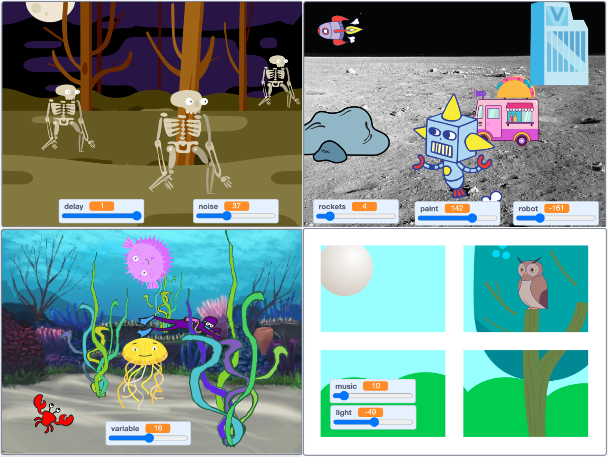

## Introduction
You'll create a 3D scene that can be controlled with variables. The user will be able to act as the 'director' of the scene and play around until they get it just the way they want it. 

Your scene doesn't have to be sensible. You should try and make it fun for you and others to play around with. 

## What you will make
You will create a scene that uses a `layers`{:class="block3looks"}, `size`{:class="block3looks"}, `sound`{:class="block3sound"} and `motion`{:class="block3motion"} to create a 3D effect. You will add `variables`{:class="block3variables"} with sliders to control features of your scene so that the user can play around and customize the scene. 

You will see some examples and then plan your own scene. You will apply your coding and graphic skills to make a unique 3D scene of your own.  

{:width="500px"}

--- collapse ---
---
title: What you will need
---
### Hardware

+ A computer or tablet capable of running Scratch
+ This projects features sound, headphones are recommended

### Software

+ Scratch 3.0 (either [online](http://rpf.io/scratchon){:target="_blank"}, or [offline](http://rpf.io/scratchoff){:target="_blank"})

--- /collapse ---

--- collapse ---
---
title: Skills you should have
---
Before starting this project, we recommend you complete the the first three projects in the [Look after yourself](https://projects.raspberrypi.org/en/pathways/look-after-yourself){:target="_blank"} pathway: 
+ [Stress ball](https://learning-admin.raspberrypi.org/en/projects/stress-ball){:target="_blank"}
+ [Butterfly garden](https://learning-admin.raspberrypi.org/en/projects/butterfly-garden){:target="_blank"}
+ [Serene Scene](https://learning-admin.raspberrypi.org/en/projects/serene-scene){:target="_blank"}

For this project, you need to know how to:  

<mark>How many of the skills from the previous challenge should we keep here?</mark>
+ Add code to sprites and a backdrop
+ Use the tools in the Paint editor to add details to a sprite
+ Add `graphic effects`{:class="block3looks"} and `sound`{:class="block3sound"} to a sprite
+ Use `Motion`{:class="block3motion"} blocks to create animation
+ Use costumes to customise sprites
+ Use the `forever`{:class="block3control"} block
+ Use the `next costume`{:class="block3control"} and `wait`{:class="block3control"} blocks to animate a sprite

+ Make a `variable`{:class="block3control"}, turn it into a slider with a range and use it as an input to a block
+ Use `layers`{:class="block3looks"} blocks to move Sprites in front or behind other Sprites
+ Use `wait`{:class="block3control"} blocks to add a delay 
+ Use simple `operators`{:class="block3operators"} to do calculations

--- /collapse ---

--- collapse ---
---
title: What you will learn
---

+ How to plan a project and then make it
+ How to apply your skills to make a project that is fun to play with
+ How to get feedback on your ideas from others

--- /collapse ---

--- collapse ---
---
title: Additional information for educators
---

You can [download the completed project here](http://rpf.io/p/en/make-a-difference-get).

If you need to print this project, please use the [printer-friendly version](https://projects.raspberrypi.org/en/projects/make-a-difference/print){:target="_blank"}.

--- /collapse ---

