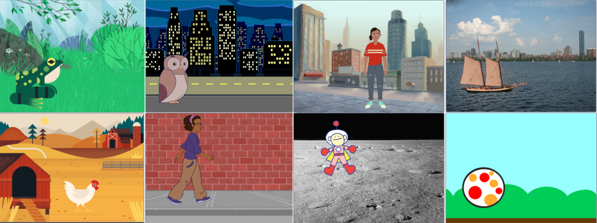
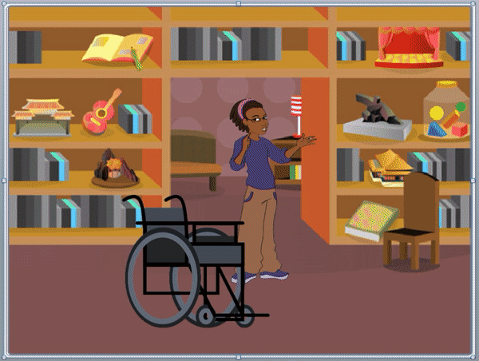

## Choose your theme

Now it's time to work on your own project. You may be bursting with ideas already, or you may need to take a few minutes to decide on a theme you want to work with. 

When you think about a stage or theatre in real life, you understand that the actors can move closer or further away from the audience; so that one can pass in front of another. This is called **depth**, and it makes things feel more realistic when you watch them (even cartoons!)

When we look at things which are further away in real life, they look a lot smaller than they do up close. If we really want our animation to look realistic, we can change the size of our sprites to mimic this effect.

This will help to create a greater sense of depth in your scene. Bigger sprites appear to be closer to the front of the stage with smaller sprites appearing further away.

--- task ---

Open a [new Scratch project](https://scratch.mit.edu/projects/editor){:target=”_blank”}. Take five minutes to think about **your** '3D scene' project. 

+ What mood do you want to create? Will it be relaxing, energising, or funny?

Your scenery is what makes up your scene - it tends to be made up of anything which in real-life does not move. This could include a mountainscape with pine trees, a street with houses, a wood with flowers, the moon with rocks, or a bedroom wall with furniture - whatever suits your project best.

In this project, for your scenery, you can **Choose a Backdrop** or make one. You can also **Choose a Sprite** or make them. 

--- /task ---

Below are some examples of **How to…**. You can use these if you need a reminder, or to understand blocks in more detail.

--- task ---
Add a backdrop of your choice. Don't worry too much as you can change it at any time as you develop your idea. 

Objects which are already drawn onto a backdrop cannot be programmed. Choose a simple backdrop with just a few or no objects drawn on it. This will give you more freedom as you go on to create sprites as part of your scenery in the next step.

Objects that are drawn on a backdrop are not sprites, they cannot be layered or programmed and therefore cannot be animated. In the below example, the wooden chair drawn is drawn onto the backdrop and cannot be programmed but the **Wheelchair** sprite can.  

{:width="1000px"}

--- collapse ---
---

title: Choose a Backdrop

---

In the bottom-right of the **Stage pane**, click on **Choose a Backdrop**.

You can search for a backdrop or browse for one by category or theme. Click on a backdrop to select it.

--- /collapse --- 

--- /task ---

--- task ---

Add your first sprite. You will always be able to change the way it looks or add more sprites later.

--- collapse ---
---

title: Choose a sprite

---

Click **Choose a Sprite** to see the library of all Scratch sprites.

You can search or browse sprites by theme. Click on a sprite to add it to your project.

--- /collapse --- 

--- /task ---

--- task ---

Give your project a name that matches your theme. 

--- collapse ---
---

title: How do I give my project a name?

---

Click in the project name box and change the name to match your project. 

If you share your project, then others will also see this name, so make sure it makes sense. 

--- /collapse --- 

--- /task ---

--- save ---

