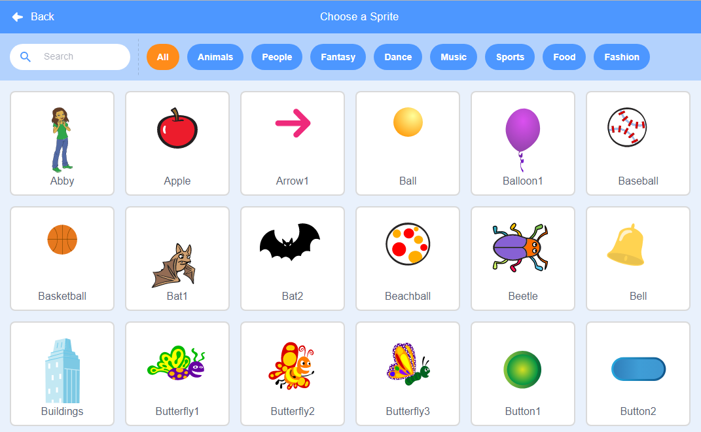

## Choose your theme

Now it's time to work on your own project.

--- task ---

+ Take five minutes to think about **your** '3D scene' project. 
+ What mood do you want to create? Will it be relaxing, energising, or funny?

--- /task ---

--- task ---

+ What will your scenery look like? 

Imagine a stage in the theatre. Scenery tends to be made up of anything which in real-life does not move such as a mountainscape with pine trees, a street with houses, a forest with flowers, the moon with rocks, or a bedroom wall with furniture - whatever suits your project best. 

Things which are further away from the audience are smaller and lighter in colour. This creates a greater sense of depth and helps to make things more realistic.

Look at the examples below:

--- /task ---

--- task ---

Objects which are already drawn onto a backdrop cannot be programmed.

Objects that are drawn on a backdrop are not sprites, they cannot be layered or programmed and therefore cannot be animated. In the below example, the wooden chair drawn is drawn onto the backdrop and cannot be programmed but the **Wheelchair** sprite can.  

{:width="1000px"}

--- /task ---

--- task ---

Open a [new Scratch project](https://scratch.mit.edu/projects/editor){:target=”_blank”}.

Think about what backdrop and sprites will you choose and/or create for your scenery. In this project, for your scenery, you can **Choose a Backdrop** or make one. For other objects in your scene you can either **Choose a Sprite** or make them. The choice is yours.

--- /task ---

--- /task ---

--- task ---

Now think again the theatre where characters move through the scenery. 

--- /task ---

--- /task ---

Below are some examples of **How to…**. You can use these if you need a reminder, or to understand blocks in more detail.

--- task ---

Add a backdrop of your choice. Don’t worry about it too much, you can change it as you develop your idea. Below are some examples of **How to …**. You can use these if you need a reminder, or to understand blocks in more detail.

--- collapse ---
---

title: Choose a backdrop

---

In the bottom-right corner of the Stage pane, click on **Choose a Backdrop**.

You can search for a backdrop, or browse for one by category or theme. Click on a backdrop to select it.

--- /collapse ---

--- /task ---

--- task ---

Add your first sprite. You will be able to change the way it looks or add more sprites later.

--- /collapse ---

--- /task ---

--- task ---

--- collapse ---
---

title: Choose a sprite

---

In the Sprite pane, click **Choose a Sprite** to see the library of all Scratch sprites.

You can search or browse sprites by theme. Click on a sprite to add it to your project.

--- /collapse ---

--- /task ---

--- task ---

Give your project a name that matches your theme. 

--- collapse ---
---

title: How do I give my project a name?

---

Click in the project name box and change the name to match your project. 

If you share your project, then others will also see this name, so make sure it makes sense. 

--- /collapse --- 

--- /task ---

--- save ---

