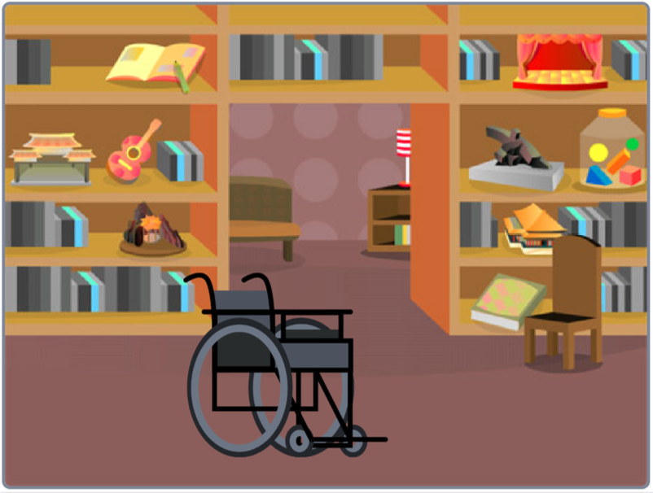

## Choose your theme

Now it's time to work on your own project. In this step you will think about your project idea. In the next step, you will then begin to create your project with a backdrop and sprites.

--- task ---

+ Take five minutes to think about **your** '3D scene' project. 
+ What mood do you want to create? Will it be relaxing, energising, or funny?

--- /task ---

--- task ---

What will your scenery look like? 

Imagine a stage in the theatre. Scenery tends to be made up of anything which in real-life does not move such as a mountainscape with pine trees, a street with houses, a forest with flowers, the moon with rocks, or a bedroom wall with furniture - whatever suits your project best. 

NEW EXAMPLES NEEDED!

Look at the examples below. Each  project is made up of one backdrop and a number of sprites to create a 3D scene:

--- /task ---

--- task ---

Open a [new Scratch project](https://scratch.mit.edu/projects/editor){:target=”_blank”}.

Give your project a name that matches your theme. 

--- collapse ---
---

title: How do I give my project a name?

---

Click in the project name box and change the name to match your project. 

If you share your project, then others will also see this name, so make sure it makes sense. 

--- /collapse --- 

--- /task ---

--- task ---

Objects which are already drawn onto a backdrop are not sprites so they cannot be layered or programmed and therefore cannot be animated. In the below example, the wooden chair is drawn onto the backdrop and cannot be programmed but the **Wheelchair** sprite can.

{:width="1000px"}

Begin to think about the backdrop for your 3D scene. Just think and explore for now. You might want to explore the backdrops gallery for inspiration.

In this project, for your scenery, you can **Choose a Backdrop** or you'll be able to make one. 

Remember to use **How to…** if you need support.

--- collapse ---
---

title: Choose a backdrop

---

In the bottom-right corner of the Stage pane, click on **Choose a Backdrop**.

You can search for a backdrop, or browse for one by category or theme. Click on a backdrop to select it.

--- /collapse ---

--- /task ---

--- task ---

Now think about what **object** will you choose and/or create to sit in your scenery. You can either **Choose a Sprite** or again, you'll also be able to make them. The choice is yours. Just think, imagine and explore for now. You might want to explore the sprite gallery for inspiration.

--- collapse ---
---

title: Choose a sprite

---

In the Sprite pane, click **Choose a Sprite** to see the library of all Scratch sprites.

You can search or browse sprites by theme. Click on a sprite to add it to your project.

--- /collapse ---

--- /task ---

--- task ---

As in the theatre, characters move through the scenery.  

What characters will you choose and/or create?

--- /task ---

--- task ---

Things which appear smaller and lighter in colour look further away from the audience/user. This is a useful effect to use to create a greater sense of depth and helps to make things more realistic. Remember these effects as you move through your project.

EXAMPLE

--- /task ---

Great thinking! In the next step you will begin to create your project. 

--- save ---

