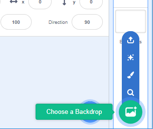

## Choose your theme

Now it is time to take five minutes to think about **your** '3D scene' project.

--- task ---

What mood do you want to create? Will it be relaxing, energising, or funny?
What will your scenery look like?
What objects and characters will you include?
What 3D effects will you use?
What will the user be able to control?

--- /task ---

--- task ---

Open a [new Scratch project](https://scratch.mit.edu/projects/editor){:target=”_blank”}.

Give your project a name that matches your theme. Remember to use a **How to…** when you need support.

--- collapse ---
---

title: How do I give my project a name?

---

Click in the project name box and change the name to match your project. 

If you share your project, then others will also see this name, so make sure it makes sense. 

--- /collapse --- 

--- /task ---

--- task ---

Begin to think about the backdrop for your 3D scene. You can choose a backdrop or you can make one in thenext step. You might want to explore the **Backdrops gallery** for inspiration. You can always change your mind later on in the project.

--- collapse ---
---

title: Explore the backdrops gallery

---

In the bottom-right corner of the Stage pane, click on **Choose a Backdrop**.

You can search for a backdrop, or browse for one by category or theme. Click on a backdrop to select it.

--- /collapse ---

--- /task ---

--- task ---

Now think about what **object** or **objects** will you choose and/or create to sit in your scenery. You can either choose a sprite or again, you can make them in the next step. The choice is yours. You might want to explore the **Sprites gallery** for inspiration.

--- collapse ---
---

title: Explore the sprites gallery

---

In the Sprite pane, click **Choose a Sprite** to see the library of all Scratch sprites.

You can search or browse sprites by theme. Click on a sprite to add it to your project.

--- /collapse ---

--- /task ---

--- task ---

What **character** or **characters** will you choose and/or create? You might want to explore the **Sprites gallery** for inspiration.

--- /task ---

Great thinking and imaging! In the next step you will begin to make your project. 

--- save ---

