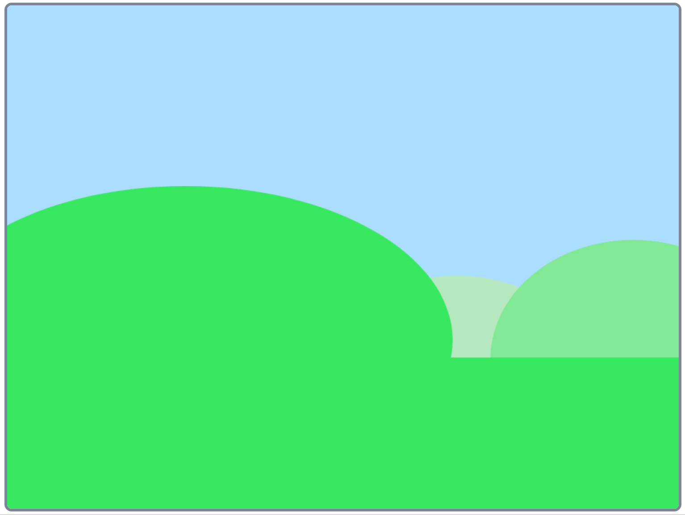
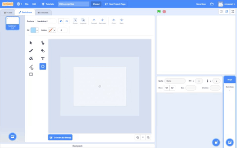
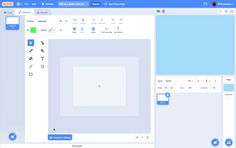
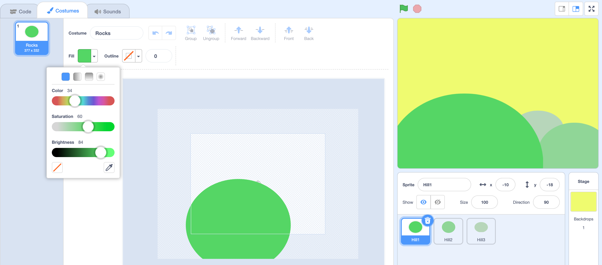
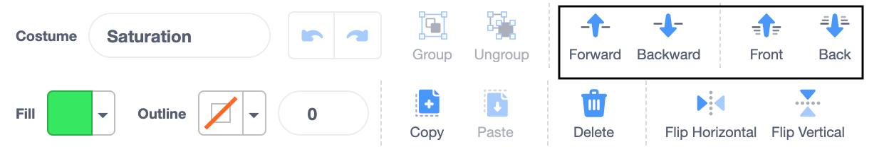
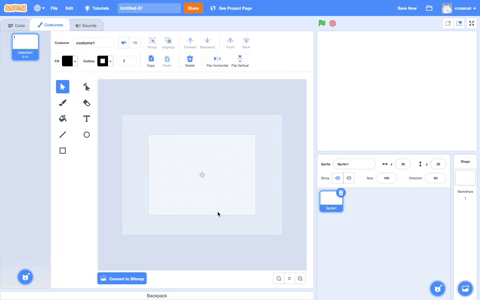
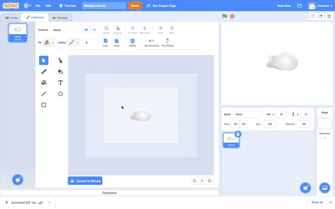
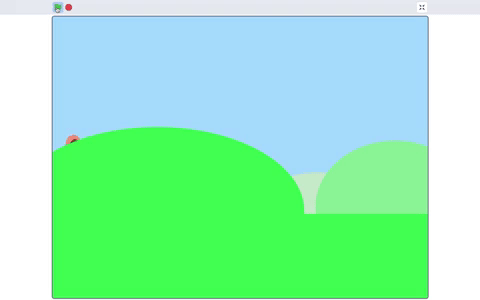
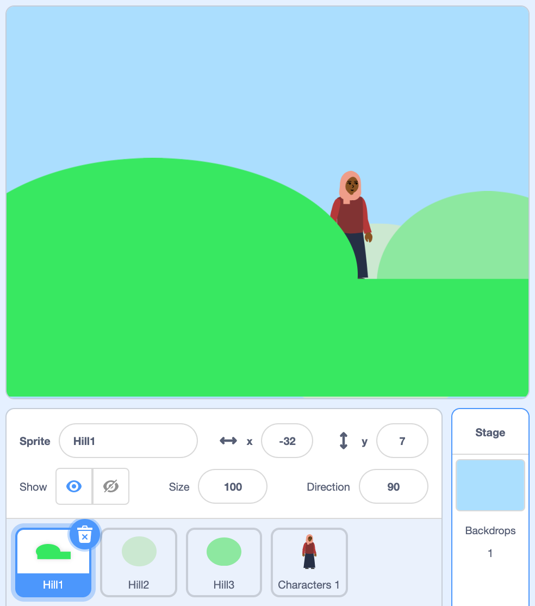
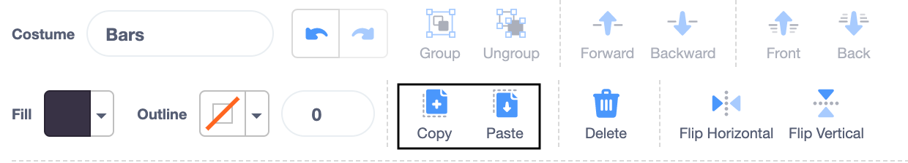

## Scenery

In this step you will create scenery with one backdrop and a series of sprites using the **Paint editor**. In the next step you will create sprites which sit behind other sprites and are smaller and lighter in colour to appear further away from the audience/user. Layers, size and colour are traditional techniques which are used by landscape painters to create a sense of depth. The effects can be used to make your '3D scene' appear more realistic. 

Throughout this step, organise your sprites into their layer position by dragging them in front of one another. In the next step, you will program your sprites so they are organised into those layers.

--- no-print ---

--- /no-print ---

--- task ---

Now make a scenery sprite. You can use your chosen backdrop, change your chosen backdrop or create your own backdrop.

In this step you are going to work with the **Paint editor** where there are two types of graphics options: **vector** and **bitmap**. The **Costume editor** automatically opens in the vector graphic setting. You will be using vector graphics for this project.

**Hills**: [See inside](https://scratch.mit.edu/projects/445193602/editor){:target="_blank"}

{:width="400px"}

--- collapse ---
---

title: Create your scenery from a backdrop and sprites

---

Below is an example of a **Sky** background with **Hill** sprites. You can use the example below to create any background and objects you require in your scene.

To make your own backdrop:
+ Go to the **Stage pane**, click **Backdrops** and selecting **Paint**.

{:width="400px"}

+ In the **Backdrops** tab, select a suitable **Fill** colour with no **Outline**. Go to the **Rectangle** shape and draw a rectangle, ensuring you cover all of the stage area (shown as an outline in the **Paint Editor**). Don't forget to title your backdrop.

{:width="400px"}

+ Now you will create sprites for your scenery which will sit on the **Sky** backdrop.

+ Go to **Choose a Sprite** and select **Paint** to create a new sprite costume which in this example will be hills.

{:width="400px"}

+ Choose a colour and draw a series of ovals using the **Circle** tool. Then draw a rectangle at the bottom of the circles using the same **Fill** colour.

In the real-world, objects that sit further away appear lighter in colour - to achieve a more realistic effect you can lower the colour **Saturation** of the ovals that are smaller to make them appear further away.

{:width="400px"}

+ Use the **Front** and **Back** tools in the **Paint editor** to move your shapes forward or backwards so they sit correctly within your background.

{:width="400px"}

+ You can select all the shapes and **Group** them together so that you can adjust them or move them as one shape.

{:width="400px"}

+ Don't forget to title your backdrop and sprite. It also helps to title each costume.

--- /collapse ---

--- /task ---

--- task ---

Here's some other effects you can create in the Paint editor. Use the effects that fit into your project idea.

--- collapse ---
---

title: Create a sprite costume using the Line tool

---

Following the same method you used on the above task to make hills, you can create geometric shapes such as traingle. This example creates a single house in silhouette.

Go to **Choose a Sprite** and select **Paint** to create a new sprite costume which in this example will be houses.

**House**: [See inside](https://scratch.mit.edu/projects/447278432/editor){:target="_blank"}

{:width="400px"}

Following the below, you can any shape using the linetool:
+ Choose a **Fill** colour with no outline
+ Draw a rectangle using the **Rectangle** tool
+ Draw a triangle using the **Line** tool. Make sure you complete the trangle otherwise it will not fill with colour
+ Move the two shapes together
+ Select the **Bucket** tool and fill the triangle
+ Draw another rectangle shape for the chimney using the **Rectangle** tool
+ You can use the **Front** and **Back** tools in the **Paint editor** to move your shapes forward or backwards so they sit correctly. You won't need to do this for this example because the shapes are black for the silhouette
+ Select all the shapes and **Group** them together so that you can adjust them or move them as one shape

To make multiples of your shapes such as a skyline of houses, follow the **How to...** 'Multiple shapes in a sprite costume' below.

--- /collapse ---

--- collapse ---
---

title: Create a sprite costume with multiple shapes

---

In your 3D scene, you may want to create multiple copies of a shape within a costume so your scenery will appear busier or more crowded.

**Multiple clouds**: [See inside](https://scratch.mit.edu/projects/447278432/editor){:target="_blank"}

{:width="400px"}

The effect of multiplying shapes is used by professional animators to create the impression of: weather patterns such as rain or clouds; a cluster of objects such as buildings or a wood; as well as a crowd of people in a scene.

--- no-print ---

--- /no-print ---

Following the below, you can multiply any type of shape:
+ Go to **Choose a Sprite** and select, in this example, the **Cloud** sprite
+ In the **Costumes editor**, using the **Select** tool highlight the whole of the shape
+ Create multiples of the shape using the **Copy** and **Paste** tools
+ Move the shape within the stage area using the **Select** tool
+ Varying the size of the shapes will also help to create a greater sense of 3D-dimensions
+ You can select all the shapes and **Group** them together so that you can adjust them or move them as one shape

--- /collapse ---

--- collapse ---
---

title: Create a new sprite for each shape

---

You can create shapes as individual sprites rather than as one sprite costume. Then another sprite can move between the shapes. This may suit your project. 

**Hills as sprites**: [See inside](https://scratch.mit.edu/projects/446137341/editor){:target="_blank"}

{:width="400px"}

--- /collapse ---

--- collapse ---
---

title: Create a masking sprite

---

You can view your 3D scene **through** a **Masking** sprite. If it sits as the front layer and is the size of the stage it will look like view through the bars of a cage or a series of window panes, surveying a scene through binoculars or wearing a mask. 

--- no-print ---

**Caged lion**: [See inside](https://scratch.mit.edu/projects/445680159/editor){:target="_blank"}

--- /no-print ---

Following the below, you can any type of masking sprite:
+ Go to **Choose a Sprite** and select **Paint**
+ Choose a colour with no **Outline** and draw a vertical rectangle. 
+ Repeat this shape by using the **Copy** and **Paste** tools. 
+ Move the shapes around using the **Select** tool 
+ As you place your shapes make sure they are touching the edge of the stage to fit in with your project idea

--- /collapse ---

--- /task ---

--- save ---

