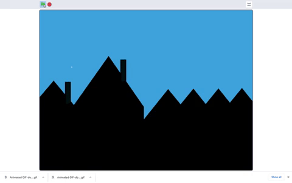

## Scenery

You have selected a backdrop and a sprite. Now it's time to think about what other sprites you want in your **scenery**. In this step you will create other sprites using the **Paint editor**.

The wooden chair below cannot be animated because it is drawn on to the backdrop and therefore cannot be programmed. The added **Wheelchair** sprite can be animated because sprites can be programmed.

{:width="1000px"}

By developing some of your backdrop as a sprite or a series of sprites you can create some interesting, 3-dimensions effects which will make your scenery appear more realistic.

For example, the moon can rise behind the houses because they are both sprites.

In Scratch, objects that in the real-world don't move, such as buildings, can move if they are created as sprites. In the example below the moving **Building** sprites create the sense that the car is driving.

{:width="400px"}

--- task ---

In this step you are going to work a lot in the **Paint editor** where there are two graphics settings: **vector** and **bitmap**. Build your confidence with these graphic settings when developing sprite costumes by exploring the **How to...** below.

--- collapse ---
---

title: Vector and bitmap graphics in the Costume editor

---

The **Costume editor** automatically opens in the vector graphic setting.

{:width="400px"}

You can go to bitmaps by selecting the blue button **Convert to Bitmap** if you would prefer to use pen marks to develop your sprite costume:

{:width="400px"}

Vector and bitmap graphics have different **Costume editors** whilst offering similar tools. Vector has an additional tool, **Reshape**:

{:width="150px"}

Using this tool you can move the position of the **nodes**, turn or pull the **handles**, and add more nodes to your shape:

--- no-print ---

--- /no-print ---

**Vector graphics** are made up of splines (mathmatical curves) and appear as shapes with a set of control points which means they can be reshaped easily and still maintain a high resolution (smooth appearance).

**Bitmap graphics** are made from grids of pixels, they tend to be low resolution (low quality) and may appear a little 'blocky', expecially when the image is enlarged.

Using your chosen sprite, go to the **Paint editor** and zoom in on a bitmap graphic using the **maginifing tool** where you will see the grids of pixels. On a vector graphic there are no pixels, just control points.

{:width="400px"}

--- /collapse ---

--- /task ---

In order to program aspects of your Backdrop you will now add sprites. You may need to change or alter your Backdrop if the one you have chosen won't allow you to realise your project idea because it has drawn objects which you want to animate. 

--- task ---

As you workthrough this step don't forget that layers can be used to change the way a sprite appears in relation to other sprites. Layering also helps sprites appear to sit three-dimensional within a scene. All sprites can be layered. For now, organise your sprites into their layer position by dragging them in front of one another. (In the next step, you will program your sprites so they are organised into those layers).

--- no-print ---

--- /no-print ---

--- /task ---

--- task ---

Now design your own Backdrop or create another sprite to go in your scene.

--- collapse ---
---

title: Design your own **scenery** sprites

---

The Backdrop is the very back of your scene - it might be a skyline, a street, a forest or a bedroom wall - whatever suits your project best. 

Below is an example of a blue **backdrop** with hills as sprite costumes. You can use the example to create the Backdrop and objects you require in your scenery.

To create a sky blue backdrop go to **Backdrops** and select **Paint**.

{:width="400px"}

In the **Backdrops tab**, select a suitable **Fill** colour with no **Outline**. Go to the **Rectangle** shape and draw a rectangle, ensuring you cover all of the stage area shown as an outline in the **Paint Editor).

{:width="400px"}

Now go to **Choose a Sprite** and select **Paint** to create a new sprite costume which in this example is a few hills.

{:width="400px"}

Choose a colour and a series of ovals using the **Circle** tool. Draw a number of ovals and a rectangle at the bottom of the **Costume Editor**.

Objects that sit further away in your scene could appear lighter in colour - to achieve this you can lower the sprite costume's colour **Saturation**. The sprite costume will then appear further away. Altering the colour saturation to create a sense of depth is a traditional technique used by landscape painters.

{:width="400px"}

Use the **Front** and **Back** tools to move your shape so it sits correctly within your scene.

{:width="400px"}

Now select the shapes and **Group** them together. You will now be able to adjust or move them as one shape.

{:width="400px"}

Don't forget to title your sprite. Also title each costume.

You can also create shapes as objects in a number of sprite costumes. Then a character sprite can move between the shape objects. This may suit your project. 

{:width="400px"}

--- /collapse ---

--- /task ---

--- task ---

--- task ---

You can create sprites which are the same colour or texture as the background so they are invisible but can be layered. Another sprite can then **appear** to come out from behind the invisible sprite.

--- no-print ---

--- /no-print ---

--- collapse ---
---

title: Make an invisible sprite

---

WRITE SRTUFF HERE! Mouse from hole. Copy part of backdrop a sprite to look like there’s a hole in the backdrop

--- /collapse ---

--- /task ---

--- task ---

In your 3D scene, you may want to create multiple copies of a shape within a costume so your scenery will appear busier. This effect is used by professional animators to create weather patterns (rain and clouds), to create a cluster of objects such as buildings or a wood as well as create the impression of a crowd of people in a scene.

--- no-print ---

--- /no-print ---

--- collapse ---
---

title: Multiple shapes in a sprite costume

---

Go to **Choose a Sprite** and select **Cloud**. Go to the **Select** tool to select the whole of the cloud shape. 

Create multiples of the shape using the **Copy** and **Paste** tools. 

Move the shapes around using the **Select** tools. Vary the size of the shapes. This will also help to create a greater sense of 3D-dimensions.  

--- /collapse ---

--- /task ---

--- task ---

Sprites as large as the Stage can sit in the 3D scene as the foreground (the very front layer). The scene will then appear **through** this sprite just like looking through the bars of a cage, a window, binoculars or a mask.

--- no-print ---

--- /no-print ---

--- collapse ---
---

title: Make a sprite mask

---

Go to **Choose a Sprite** and select **Paint**, choose a colour and draw a rectangle. You can repeat this shape by using the **Copy** and **Paste** tools. Move the shapes around using the **Select** tool.

--- /collapse ---

--- /task ---

In addition to coding layers to create a sense of 3-dimensions, in the next step you will also change the size of sprites in relation to each other. This will help to create a greater sense of depth to your scenery. Bigger sprites appear to be closer to the front of the stage with smaller sprites appearing further away.

--- save ---

