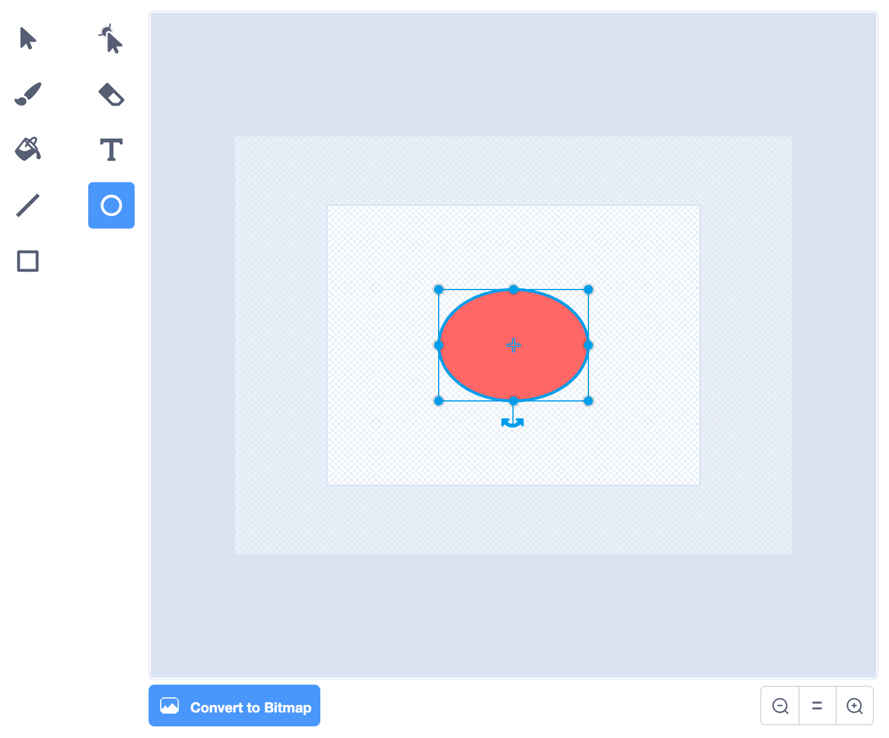
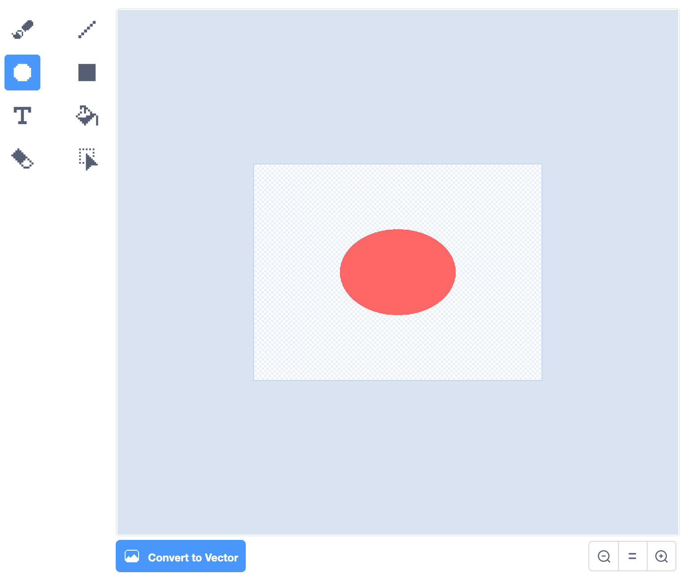

## Scenery

You have selected a backdrop and a sprite. Now it's time to think about what other sprites you want in your **scenery**. In this step you will create other sprites using the **Paint editor**.

Objects that are drawn on a backdrop are not sprites, they cannot be layered or programmed and cannot be animated. In the below example, the wooden chair drawn on the backdrop cannot be animated but the **Wheelchair** sprite can.  

{:width="1000px"}

In the below example the **Moon** sprite can rise from behind the **Skyline** sprite. There is a **Sky** (blue) backdrop. The **Sky** backdrop and the **Skyline** sprite are referred to as the **background** as they are something which are created or adapted. By developing some of your background as a sprite or a series of sprites you can create some interesting, 3-dimensional effects which will make your scenery appear more realistic.

Because both the **Moon** and the **Skyline** are sprites they can be layered and programmed.

In Scratch, objects that in the real-world don't move, such as buildings, can move if they are created as sprites. In the example below the moving series of **Tower block** sprites create the sense that the static car is driving.

{:width="400px"}

In this step you are going to work with the **Paint editor** using two type of graphics: **vector** and **bitmap**. 

--- task ---

Build your confidence with these vector and bitmap graphics when developing sprite costumes by exploring the **How to...** below.

--- collapse ---
---

title: Vector and bitmap graphics

---

The **Costume editor** automatically opens in the vector graphic setting.

{:width="400px"}

If you would prefer to use pen marks to develop your sprite costume you can go to bitmaps by selecting the blue button **Convert to Bitmap**.

{:width="400px"}

Vector and bitmap graphics have different **Costume editors**. Both offer similar tools. Vector offers an additional tool - **Reshape**:

{:width="150px"}

Using the **Reshape** tool you can move the position of the **nodes**, turn or pull the **handles**, and add more nodes to your shape:

--- no-print ---

--- /no-print ---

**Vector graphics** are made up of splines (mathmatical curves) and appear as shapes with a set of control points which means they can be reshaped easily and still maintain a high resolution (smooth appearance).

**Bitmap graphics** are made from grids of pixels, they tend to be low resolution (low quality) and may appear a little 'blocky', expecially when the image is enlarged.

Using your chosen sprite, go to the **Paint editor** and zoom in on a bitmap graphic using the **maginifing tool** where you will see the grids of pixels. On a vector graphic there are no pixels, just control points.

{:width="400px"}

--- /collapse ---

--- /task ---

--- task ---

Throughout this step, organise your sprites into their layer position by dragging them in front of one another. (In the next step, you will program your sprites so they are organised into those layers).

--- no-print ---

--- /no-print ---

--- /task ---

Now make a background sprite object for your scene using your chosen backdrop or by creating a plain backdrop.

If your chosen backdrop has drawn objects on it which you now want to animate you may need to change the backdrop to realise your project.

--- task ---

--- collapse ---
---

title: Create a background from backdrop and sprites

---

The background is the very back of your scene - it might be a skyline, a street, a forest or a bedroom wall - whatever suits your project best. 

Below is an example of a **Sky** background with **Hill** sprites. You can use the example below to create any background and objects you require in your scene.

To create a sky blue backdrop go to **Backdrops** in the **Stage pane** and select **Paint**.

{:width="400px"}

In the **Backdrops tab**, select a suitable **Fill** colour with no **Outline**. Go to the **Rectangle** shape and draw a rectangle, ensuring you cover all of the stage area (shown as an outline in the **Paint Editor**). Don't forget to title your backdrop.

{:width="400px"}

Now you will create background sprites for your scene which will sit on the **Sky** backdrop.

Go to **Choose a Sprite** and select **Paint** to create a new sprite costume which in this example will be hills.

{:width="400px"}

Choose a colour and draw a series of ovals using the **Circle** tool. Then draw a rectangle at the bottom of the bottomof the same colour.

Inthereal-world, objects that sit further away appear lighter in colour - to achieve a more realistic effect you can lower the colour **Saturation** of the ovals that are smaller to make them appear further away. Altering colour saturation to create a sense of depth is a traditional technique used by landscape painters.

{:width="400px"}

Use the **Front** and **Back** tools in  the**Paint editor** to move your shapes foreward or backwards so they sit correctly within your background.

{:width="400px"}

You can select all the shapes and **Group** them together so that you can adjust them or move them as one shape.

{:width="400px"}

Don't forget to title your sprite. It also helps to title each costume.

You can also create the same shapes as sprites rather than as a sprite costume. Then a character sprite can move between the shapes. This may suit your project. 

{:width="400px"}

--- /collapse ---

--- /task ---

--- task ---

Sprites which are the same colour as their surrounding are invisible. Another sprite can **appear** to come out from behind the invisible sprite. This effect is useful for sprites which seem to appear through a hole, crack or doorway.

--- no-print ---

--- /no-print ---

--- collapse ---
---

title: Make an invisible sprite

---

To make an invisible sprite:
+ make a shape (without an outline) in **Vector** graphics ensuring that the shape is suitable to cover the area of background
+ copy the background colour using the **Eye dropper** tool
+ **Fill** the invisible shape
+ You may need to move, resize or adapt the shape of the **Invisible** sprite until covers the area correctly

--- /collapse ---

--- /task ---

--- task ---

In your 3D scene, you may want to create multiple copies of a shape within a costume so your scenery will appear busier or more crowded.

--- no-print ---

--- /no-print ---

--- collapse ---
---

title: Multiple shapes in a sprite costume

---

The effect of multiplying shapes is used by professional animators to create the impression of: weather patterns such as rain or clouds; a cluster of objects such as buildings or a wood; as well as a crowd of people in a scene.

Go to **Choose a Sprite** and select **Cloud**. In the **Costumes editor**, using the **Select** tool highlight the whole of the **Cloud** costume. 

Create multiples of the shape using the **Copy** and **Paste** tools. 

Move the shapes around using the **Select** tool. Varying the size of the shapes will also help to create a greater sense of 3D-dimensions.  

--- /collapse ---

--- /task ---

--- task ---

A sprite the size of the stage area and as the front layer in your 3D scene will create the impression that your 3D scene is visible **through** it. For instance like being behind the bars of a cage, looking through a window, surveying a scene through binoculars or wearing a mask.

--- no-print ---

--- /no-print ---

--- collapse ---
---

title: Make a masking sprite

---

Go to **Choose a Sprite** and select **Paint**, choose a colour and draw a rectangle. You can repeat this shape by using the **Copy** and **Paste** tools. Move the shapes around using the **Select** tool. As you place your shapes make sure they touch the edge of the stage to fit in with your project idea.

--- /collapse ---

--- /task ---

In addition to coding layers to create a sense of 3-dimensions, in the next step you will also change the size of sprites in relation to each other. This will help to create a greater sense of depth to your scenery. Bigger sprites appear to be closer to the front of the stage with smaller sprites appearing further away.

--- save ---

