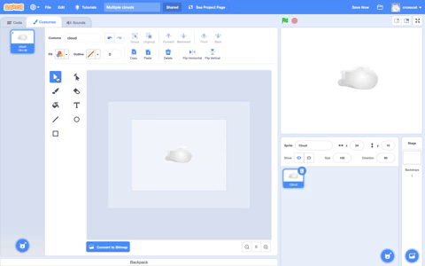

## Set the scene

In this step you will set the scene by creating or choosing a backdrop. You will also create and/or choose sprites go in front of the backdrop. In this step you will drag your sprites to layer them.

**Jumping shark**: [See inside](https://scratch.mit.edu/projects/454124566/editor){:target="_blank"}

--- no-print ---

  <iframe src="https://scratch.mit.edu/projects/454124566/embed" allowtransparency="true" width="485" height="402" frameborder="0" scrolling="no" allowfullscreen></iframe>

A backdrop is **always** at the back and cannot move. In this example project, the backdrop is the orange **Sky**. 

Sprites can move around the stage, and be in front of or behind other sprites. In this example project, the **Shark** sprite is able to jump from behind the waves because the waves are not drawn on the backdrop. The **Waves** are a sprite. Additional scenery, such as hills, trees or buildings can be added as sprites that can then be moved around.

--- /no-print ---

--- task ---

Use the Paint editor to create your own backdrop and scenery sprites OR **Choose a Backdrop** from the Scratch library.

--- collapse ---
---

title: Create a plain backdrop

---

To make your own backdrop:
+ Go to the Stage pane and click on **backdrop1**.

{:width="400px"}

+ Click on the **Backdrops** tab.
+ Select a suitable **Fill** colour with no **Outline**.
+ Go to the **Rectangle** tool and draw a rectangle, ensuring you cover all of the stage area (shown as an outline in the Paint editor). 

{:width="400px"}

Don't forget to name your backdrop.

--- /collapse ---

**Or**

--- collapse ---
---

title: Choose a backdrop from the Scratch library

---

In the bottom-right corner of the Stage pane, click on **Choose a Backdrop**.

You can search for a backdrop, or browse for one by category or theme. Click on a backdrop to select it.

--- /collapse ---

--- /task ---

--- task ---

Add any sprites that you want to use from the gallery. This could include people, animals or vehicles. It can also include existing scenery sprites such as trees, rocks or buildings. 

Remember all sprites in Scratch can move so if you want your main character to be a bunch of bananas, that's fine!

--- collapse ---
---

title: Add sprites from the gallery

---

In the Sprite pane, click **Choose a Sprite** to see the library of all Scratch sprites.

You can search or browse sprites by theme. Click on a sprite to add it to your project.

--- /collapse ---

--- /task ---

**Tip:** Whenever you drag a sprite it will jump to the front layer and in front of any other sprites.

--- task ---
Use the Paint editor to create any additional sprites that you need as scenery. This could be hills or mountains in the distance, or smaller sprites, such as trees or flowers, fro your scenery. 

Think about whether you want to create your scenery as one sprite OR whether you want some of your sprites to move through and behind the 3D scenery by creating separate scenery sprites. The latter will make it easier for you to move sprites around later depending on your ideas for your project. 

--- collapse ---
---

title: Create scenery as sprites

---

**Hill as one sprite**: [See inside](https://scratch.mit.edu/projects/452582516/editor){:target="_blank"}

{:width="400px"}

You can make your own **Hills** sprite shown in the example above by using the **Circle** and **Rectangle** tools in the Paint editor:

+ Go to **Choose a Sprite** and select **Paint** to create a new sprite costume.

{:width="400px"}

+ Choose a **Fill** colour and deselect **Outline**. Now draw an oval using the **Circle** tool. Then select the **Rectangle** tool to draw a rectangle underneath the oval.

+ If you use varying colours for the shapes you may need to use the **Front** and **Back** tools in the **Paint editor** to move your shapes forward or backwards so they sit correctly within your background.

+ You can select all the shapes and **Group** them together so that you can adjust them or move them as one shape.

{:width="400px"}

+ Now make other sprites for your scenery, if this fits in with your project idea.

+ Don't forget to name your sprite/s.

--- /collapse ---

Here's some other creative tips:

--- collapse ---
---

title: Create a triangle using the line tool

---

You can create polygons such as a triangle and use these shapes to create roofs or mountains.

Go to **Choose a Sprite** and select **Paint** to create a new sprite costume which in this example will be houses.

**House**: [See inside](https://scratch.mit.edu/projects/453595663/editor){:target="_blank"}

{:width="400px"}

Following the below, you can create any shape using the **Line** tool:
+ Choose a **Fill** colour. To choose the colour black, decrease the **Brightness** to zero (0).

{:width="400px"}

+ Select **no outline**
+ Draw a rectangle using the **Rectangle** tool
+ Draw a triangle using the **Line** tool. Make sure you complete the trangle otherwise it will not fill with colour
+ Move the two shapes together
+ Select the **Bucket** tool and fill the triangle
+ Draw another rectangle shape for the chimney using the **Rectangle** tool
+ You can use the **Front** and **Back** tools in the **Paint editor** to move your shapes forward or backwards so they sit correctly. You won't need to do this for this example because the shapes are black for the silhouette
+ Select all the shapes and **Group** them together so that you can adjust them or move them as one shape

To create duplicate shapes such as a skyline from your house, follow the **How to...** 'Create a scenery costume by duplicating shapes' below.

--- /collapse ---

--- collapse ---
---

title: Create a scenery costume by duplicating shapes

---

In your 3D scene, you may want to duplicate shapes within a costume so your scenery will appear busier or more crowded.

**Multiple clouds**: [See inside](https://scratch.mit.edu/projects/447278432/editor){:target="_blank"}

{:width="400px"}

The effect of multiplying shapes is used by professional animators to create the impression of: weather patterns such as rain or clouds; a cluster of objects such as buildings or a wood; as well as a crowd of people in a scene.

--- no-print ---

--- /no-print ---

Following the below, you can multiply any type of shape:
+ Go to **Choose a Sprite** and select, in this example, the **Cloud** sprite
+ In the **Costumes editor**, using the **Select** tool highlight the whole of the shape
+ Create multiples of the shape using the **Copy** and **Paste** tools
+ Move the shape within the stage area using the **Select** tool
+ Varying the size of the shapes will also help to create a greater sense of 3D-dimensions
+ You can select all the shapes and **Group** them together so that you can adjust them or move them as one shape

--- /collapse ---

--- collapse ---
---

title: Create depth using saturation and brightness

---

In the real-world, objects that sit further away appear lighter in colour. To achieve a more realistic 3D scenery you can **decrease** the colour **Saturation** and/or **Brightness** of each sprite so that they appear further and further away.

{:width="400px"}

--- /collapse ---

--- /task ---

**Tip:** If you find it hard to manage the sprites on your stage, such as having a large sprite that keeps covering a much smaller one, you can click **hide** so you don't see the sprite or sprites. Then click **show** again when you're done.

{:width="300px"}

--- task ---
As you add more sprites you will need to think about how they will work together in your scene. 

Here's another example:

--- collapse ---
---

title: Create a sprite with gaps that you can see through

---

You can view your 3D scene **through** a sprite. If it sits as the front layer and is the size of the stage it can appear like a view through the bars of a cage or a series of window panes.

--- no-print ---

**Caged lion**: [See inside](https://scratch.mit.edu/projects/445680159/editor){:target="_blank"}

--- /no-print ---

Following the below, you can any type of masking sprite:
+ Go to **Choose a Sprite** and select **Paint**
+ Choose a colour with no **Outline** and draw a vertical rectangle. 
+ Repeat this shape by using the **Copy** and **Paste** tools. 
+ Move the shapes around using the **Select** tool 
+ As you place your shapes make sure they are touching the edge of the stage to fit in with your project idea

--- /collapse ---

--- /task ---

--- save ---

