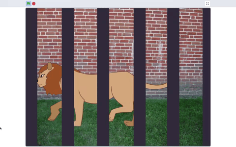

## Scenery

You have selected a backdrop and a sprite. Now it's time to think about what other sprites you want in your **scenery**. In this step you will create a background with sprites using the **Paint editor**.

Objects that are drawn on a backdrop are not sprites, they cannot be layered or programmed and therefore cannot be animated. In the below example, the wooden chair drawn is drawn onto the backdrop and cannot be programmed but the **Wheelchair** sprite can.  

{:width="1000px"}

In the below example the **Moon** sprite rises from behind the **Rooftop** sprite. Because they are both sprites they can be layered and programmed.

**Rising moon**: [See inside](https://scratch.mit.edu/projects/445119855/editor){:target="_blank"}

The background is made up by the **Sky** backdrop and the **Rooftop** sprite. By developing some of your background as a sprite or a series of sprites you can create some interesting, 3-dimensional effects which will make your scenery appear more realistic.

--- task ---

In this step you are going to work with the **Paint editor** using two type of graphics: **vector** and **bitmap**. 

Build your confidence when developing sprite costumes with vector and bitmap graphics by exploring the **How to...** below.

--- collapse ---
---

title: Vector and bitmap graphics

---

The **Costume editor** automatically opens in the vector graphic setting.

{:width="400px"}

If you would prefer to use pen marks to develop your sprite costume you can go to bitmaps by selecting the blue button **Convert to Bitmap**.

{:width="400px"}

Vector and bitmap graphics have different **Costume editors**. Both offer similar tools. Vector offers an additional tool - **Reshape**:

{:width="150px"}

Using the **Reshape** tool you can move the position of the **nodes**, turn or pull the **handles**, and add more nodes to your shape:

--- no-print ---

--- /no-print ---

**Vector graphics** are made up of splines (mathmatical curves) and appear as shapes with a set of control points which means they can be reshaped easily and still maintain a high resolution (smooth appearance).

**Bitmap graphics** are made from grids of pixels, they tend to be low resolution (low quality) and may appear a little 'blocky', expecially when the image is enlarged.

Using your chosen sprite, go to the **Paint editor** and zoom in on a bitmap graphic using the **maginifing tool** where you will see the grids of pixels. On a vector graphic there are no pixels, just control points.

{:width="400px"}

--- /collapse ---

--- /task ---

Throughout this step, organise your sprites into their layer position by dragging them in front of one another. In the next step, you will program your sprites so they are organised into those layers.

--- no-print ---

--- /no-print ---

--- task ---

Now make a background sprite for your scene using your chosen backdrop, change your chosen backdrop or by creating your own backdrop.

**Hills as a sprite costume**: [See inside](https://scratch.mit.edu/projects/445193602/editor){:target="_blank"}

{:width="400px"}

--- collapse ---
---

title: Create a background from a backdrop and sprites

---

The background is the very back of your scene - it might be a skyline, a street, a forest or a bedroom wall - whatever suits your project best. 

Below is an example of a **Sky** background with **Hill** sprites. You can use the example below to create any background and objects you require in your scene.

To create a sky blue backdrop go to **Backdrops** in the **Stage pane** and select **Paint**.

{:width="400px"}

In the **Backdrops tab**, select a suitable **Fill** colour with no **Outline**. Go to the **Rectangle** shape and draw a rectangle, ensuring you cover all of the stage area (shown as an outline in the **Paint Editor**). Don't forget to title your backdrop.

{:width="400px"}

Now you will create background sprites for your scene which will sit on the **Sky** backdrop.

Go to **Choose a Sprite** and select **Paint** to create a new sprite costume which in this example will be hills.

{:width="400px"}

Choose a colour and draw a series of ovals using the **Circle** tool. Then draw a rectangle at the bottom of the circles using the same **Fill** colour.

In the real-world, objects that sit further away appear lighter in colour - to achieve a more realistic effect you can lower the colour **Saturation** of the ovals that are smaller to make them appear further away. Altering colour saturation to create a sense of depth is a traditional technique used by landscape painters.

{:width="400px"}

Use the **Front** and **Back** tools in the **Paint editor** to move your shapes forward or backwards so they sit correctly within your background.

{:width="400px"}

You can select all the shapes and **Group** them together so that you can adjust them or move them as one shape.

{:width="400px"}

Don't forget to title your sprite. It also helps to title each costume.

--- /collapse ---

--- /task ---

--- task ---

Here's some other effects you can create in the Paint editor. Use them is they fit into your project idea.

--- collapse ---
---

title: Geometic sprite costumes

---

Following the same method you used on the above task to make hills, you can create geometric shapes such as houses.  This example creates a single house in silhouette. Got to the **How to...** 'Multiple shapes in a sprite costume' to find out how to create a skyline of houses.

Go to **Choose a Sprite** and select **Paint** to create a new sprite costume which in this example will be houses.

{:width="400px"}

Choose a colour and draw a triangle using the **Line** tool. Then draw a rectangle at the bottom of the triangle using the same **Fill** colour.

You can use the **Front** and **Back** tools in the **Paint editor** to move your shapes forward or backwards so they sit correctly. You won't need to do this for this example because the shapes are black for the silhouette.

--- /collapse ---

--- collapse ---
---

title: Multiple shapes in a sprite costume

---

In your 3D scene, you may want to create multiple copies of a shape within a costume so your scenery will appear busier or more crowded.

**Multiple clouds**: [See inside](https://scratch.mit.edu/projects/447278432/editor){:target="_blank"}

{:width="400px"}

The effect of multiplying shapes is used by professional animators to create the impression of: weather patterns such as rain or clouds; a cluster of objects such as buildings or a wood; as well as a crowd of people in a scene.

--- no-print ---

--- /no-print ---

Following the below, you can multiply any type of shape:
+ Go to **Choose a Sprite** and select, in this example, the **Cloud** sprite
+ In the **Costumes editor**, using the **Select** tool highlight the whole of the shape
+ Create multiples of the shape using the **Copy** and **Paste** tools
+ Move the shape within the stage area using the **Select** tool
+ Varying the size of the shapes will also help to create a greater sense of 3D-dimensions
+ You can select all the shapes and **Group** them together so that you can adjust them or move them as one shape

--- /collapse ---

--- collapse ---
---

title: Multiple shapes as number of sprites

---

You can also create the same shapes as sprites rather than as a sprite costume. Then a character sprite can move between the shapes. This may suit your project. 

**Hills as sprites**: [See inside](https://scratch.mit.edu/projects/446137341/editor){:target="_blank"}

{:width="400px"}

--- /collapse ---

--- collapse ---
---

title: Create a masking sprite

---

You can view your 3D scene **through** a **Masking** sprite. If it sits as the front layer and is the size of the stage it will look like view through the bars of a cage or a series of window panes, surveying a scene through binoculars or wearing a mask. 

--- no-print ---

**Caged lion**: [See inside](https://scratch.mit.edu/projects/445680159/editor){:target="_blank"}

--- /no-print ---

Following the below, you can any type of masking sprite:
+ Go to **Choose a Sprite** and select **Paint**
+ Choose a colour with no **Outline** and draw a vertical rectangle. 
+ Repeat this shape by using the **Copy** and **Paste** tools. 
+ Move the shapes around using the **Select** tool 
+ As you place your shapes make sure they are touching the edge of the stage to fit in with your project idea

--- /collapse ---

--- /task ---

--- save ---

