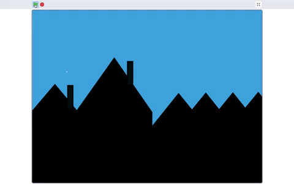

## Scenery

You have selected a backdrop. Now it's time to think about what **objects** you want in your **scenery**. In this step you will create your own objects as sprite costumes in **Paint Editor**.

--- task ---

In the real world, a backdrop if often static such as internal walls, a street or hills. Added to this are objects such as people, vehicles and furniture which are able to move in front of the backdrop. In Scratch, by developing some of your backdrop as sprites you can create some interesting, 3-dimensions effects which will make your scenery appear more realistic.

For example, the moon can rise above the hill because they are both sprites.

Unlike the real world, buildings for example, can move if they are sprites as long as they are not drawn onto the backdrop. This can create a sense of movement of another sprite, such as a car, driving in the foreground. Notice the buildings are moving, not the car.

{:width="400px"}

In order to program aspects of your backdrop you will now add objects as sprites. You may need to change or alter your backdrop if the one you have chosen won't allow you to realise your project ideas because it has drawn objects rather than objects as sprites. Below shows an example where the drawn object may be visually in the way of your project:
+ a Backdrop with a drawn chair
+ a wheelchair as a sprite
+ the wheelchair as a sprite with the Backdrop

{:width="600px"}

--- collapse ---
---

title: Design your own Backdrop and object sprite costumes

---

The backdrop is the very back of your scene - it might be a skyline, a street, a forest or a bedroom wall - whatever suits your project best. 

Below is an example of a blue **Backdrop** with hills as sprite costumes. You can use the example to create the Backdrop and objects you require in your scenery.

To create a sky blue backdrop go to **Backdrops** and select **Paint**.

{:width="400px"}

In the **Backdrops tab** and  select a suitable **Fill** colour with no **Outline**. Go to the **Rectangle** shape and draw a rectangle, ensuring you cover all of the stage area shown as an outline in the **Paint Editor).

{:width="400px"}

Now go to **Choose a Sprite** and select **Paint** to create a new sprite costume.

{:width="400px"}

Don't forget to name your sprite.

--- /collapse ---

--- /task ---

--- task ---

In **Paint Editor** in the **Costume Editor** there are two graphics settings: **vector** and **bitmap**.The **Costume Editor** automatically opens in the vector graphic setting.

**Vector graphics** are made up of splines (mathmatical curves) and are stored and drawn with these instructions. Vector graphics appear as shapes with a set of control points which means they can be reshaped easily and still maintain a high resolution (smooth appearance).

**Bitmap graphics** are made from grids of pixels, tend to be low resolution (low quality) and may appear a little 'blocky', expecially when the graphic is enlarged.

--- collapse ---
---

title: Costume Editor: vector and bitmap graphics

---

{:width="400px"}

You can go to bitmaps by selecting the blue button **Convert to Bitmap** if you would prefer to use pen marks to develop your sprite costume:

{:width="400px"}

Vector and bitmap graphics have different **Costume Editors** whilst offering similar tools. Vector offers an additional tool, **Reshape**.

{:width="150px"}

Using this tool you can move the position of the **nodes**, turn or pull the **handles**, and add more nodes to your shape.

--- no-print ---

--- /no-print ---

Using your chosen sprite, go to the **Paint Editor** and zoom in on a bitmap graphic using the maginifing tool where you will see the grids of pixels. On a vector graphic there are no pixels, just control points.

{:width="400px"}

--- /collapse ---

--- /task ---

Make two object for your scenery. Click below to design two sprite costumes.

--- no-print ---

--- /no-print ---

--- collapse ---
---

title: Make two sprite costumes

---

WRITE SRTUFF HERE! Let's make something that's usually static a sprite. Moon comes up behind mountain, Bat flies out of building. **Top tip for taking sections of other sprites to work on?**

--- /collapse ---

--- /task ---

Layers can be used to change the way a sprite appears in relation to other sprites. Layering also helps sprites appear to sit three-dimensional within a scene. You can layer all your sprites. The important thing is to remember the order that you want the sprites to sit.

--- task ---

For now, organise your sprites into their layering position by dragging them in front of one another. In the next step, you will program your sprites so they are organised into those layers.

--- /task ---

--- task ---

You can create sprites which are the same colour or texture as the background so they are invisible but can be layered. Another sprite can then **appear** to come out from behind the invisible sprite.

--- no-print ---

--- /no-print ---

--- collapse ---
---

title: Make an invisible sprite

---

WRITE SRTUFF HERE! Mouse from hole. Copy part of backdrop a sprite to look like there’s a hole in the backdrop

--- /collapse ---

In addition to coding layers to create a sense of 3-dimensions, in the next step you will also change the size of sprites in relation to each other. This will help to create a greater sense of depth to your scenery. Bigger sprites appear to be closer to the front of the stage with smaller sprites appearing further away.

Some sprites can be the size of the stage and sit in the scene as the front layer. The interactive animation will then appear to happen **through** this sprite just like looking through a window, binoculars or a mask.

--- no-print --

--- /no-print --

--- collapse ---
---

title: Make a sprite mask

---

WRITE SRTUFF HERE! Binoculars looking at scenery. window

--- /collapse ---

--- /task ---

--- task ---

In your scenery, you may want to create multiple copies of a shape within a costume so whether the sprite is static or moving your scenery will appear busier. This effect is used by proffessional animators to create weather patterns such as rain or clouds, to create a cluster of objects such as buildings and tree and to create the impression of a crowd of people in a scene.

--- no-print --

--- /no-print --

--- collapse ---
---

title: Multiple shapes in a sprite costume

---

--- /collapse ---

--- /task ---

--- save ---

