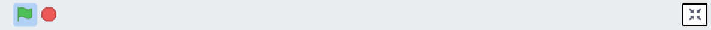

## 3-Dimensional effects

In this step you’re going to increase the 3-dimensional appearance by using the `Looks`{:class="block3looks"} blocks menu to enhance the sense of depth in your scene. You will use the `size`{:class="block3looks"} and `layers`{:class="block3looks"} blocks to make your sprites appear in front of or behind each other.

In the below example, the **Rocket** sprite which is in the distance is smaller than the **Taco Truck** and **Robot** sprites. The sprites are layered to appear to go in front of or behind each other. 

**Moon base**: [See inside](https://scratch.mit.edu/projects/451453522/editor){:target="_blank"}

<div class="scratch-preview">
  <iframe src="https://scratch.mit.edu/projects/447759319/embed" allowtransparency="true" width="485" height="402" frameborder="0" scrolling="no" allowfullscreen></iframe>
</div>

--- task ---

Where relevant, resize your sprites. Some sprites can stay the same size.

--- collapse ---
---
title: Set the size of your sprites
---

**Numbers in a row**: [See inside](https://scratch.mit.edu/projects/445071529/editor){:target="_blank"}

<div class="scratch-preview">
  <iframe src="https://scratch.mit.edu/projects/445071529/embed" allowtransparency="true" width="485" height="402" frameborder="0" scrolling="no" allowfullscreen></iframe>
</div>

Select the sprite that you want to resize and click on its **Code tab**. Add a `set size to %`{:class="block3looks"} block and change the value in the block to the percentage (%) size for that sprite.

Add a percentage value below `100` to decrease its size:

``` blocks3
when green flag clicked
+set size to (80)%
```

Add a percentage value above `100` to increase its size:

``` blocks3
when green flag clicked
+set size to (120)%
```
--- /collapse ---

--- /task ---

--- task ---

Now program your sprites into layers.

--- collapse ---
---
title: Program your sprites using front and back layers
---

You can simply program your sprites into two layers using the `front layer`{:class="block3looks"} and `back layer`{:class="block3looks"} blocks. 

**Through the window**: [See inside](https://scratch.mit.edu/projects/451497627/editor){:target="_blank"}

<div class="scratch-preview">
  <iframe allowtransparency="true" width="485" height="402" src="https://scratch.mit.edu/projects/embed/451497627/?autostart=false" frameborder="0"></iframe>
</div>

In the example, the **Window frame** sprite has a `go to front layer`{:class="block3looks"} block so it appears at the front. The **Avery Walking**, **Tree** and the **Sun** sprites each have `go to back layer`{:class="block3looks"} blocks so they appear at the back.


Select the sprite that you want at the front and click on its **Code tab**. Add a `go to front layer`{:class="block3looks"} block:

``` blocks3
when green flag clicked
go to [front v] layer
```

Select the sprite/s that you want at the back and click on its **Code tab**. Add a `go to back layer`{:class="block3looks"} block:

``` blocks3
when green flag clicked
go to [back v] layer
```

--- /collapse ---

--- collapse ---
---
title: Program your sprites in layers
---

Using the `go backward 1 layers`{:class="block3looks"} block you can place a sprite 1 layer behind the sprite at the front.

``` blocks3
when green flag clicked
go to [front v] layer
+go [backward v] (1) layers
```

Allocate layers to other sprites. Change the value in the `go backward`{:class="block3looks"}`1``layers`{:class="block3looks"} block depending on where you want each sprite to sit in relation to each other:

``` blocks3
when green flag clicked
go to [front v] layer
+go [backward v] (2) layers
```

--- /collapse ---

--- /task ---

--- task ---

Animate your sprite by moving or changing its costumes.

--- collapse ---
---
title: Move your sprite
---

Get your sprite moving:

```blocks3
when green flag clicked
point in direction (90)
set rotation style [left-right v]
forever
move (5) steps
if on edge, bounce
```

For more information, explore [Animate using motion](https://learning-admin.raspberrypi.org/en/projects/interactive-animation/3) in Challenge 1 Interactive animation.

--- /collapse ---

--- collapse ---
---
title: Change your sprite's costume
---

Get your sprite changing costumes:

```blocks3
when green flag clicked
forever
next costume
wait (0.3) seconds
```

If you want some more information explore [Animate using looks](https://learning-admin.raspberrypi.org/en/projects/interactive-animation/5) in Challenge 1 Interactive animation.

--- /collapse ---

--- /task ---

--- task ---

Click on the 'Full Screen' icon above the Stage to run your project in full screen mode. 


You can't accidentally drag sprites or sliders in full screen mode. 

Click the 'Full Screen' icon again to continue working on your project.



--- /task ---
--- save ---
