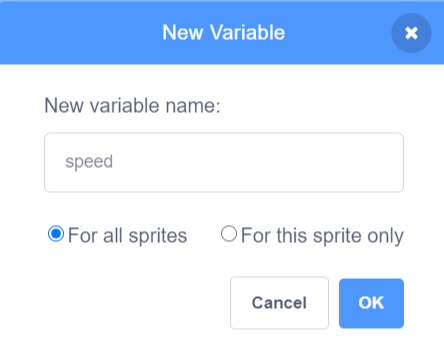

## Adjustable speed

In this step you will add a speed variable and use it to control the timing of your scene. The user will be able to drag a slider to make your project go faster or slower. 

--- task ---
Make a new variable, for all sprites, and call it `speed`{:class="block3variables"}.

--- collapse ---

---

title: Add a speed variable

---

Click on the 'Code' tab for any sprite or the Stage. 

Click on `Variables`{:class="block3variables"} and then 'Make a Variable'.
Click on `Variables`{:class="block3variables"} and then 'Make a Variable'.


Name the variable 'speed'. Keep the 'For all sprites' box checked, this means you will be able to use the variable in the code for any of your sprites or the Stage.



Click 'OK' to make the new variable. You will have new Variable blocks available including a `speed`{:class="block3variables"} block that you can use as an input to other blocks. 

--- /collapse ---

--- /task ---

--- task ---
Your new variable will automatically appear on the Stage. 

Change it to a slider with the range 1 to 10, you can change the range later. 

--- collapse ---

---

title: Use a slider to change a variable

---

Right-click or tap and hold on the `speed` variable on the Stage. 

Select 'slider' from the menu. 


**Tip:** You can double click or tap on a variable on the Stage to switch between normal, large and slider. 

Right-click or tap and hold on the `speed` variable on the Stage again and choose 'change slider range'. 


Set the range to a minimum of 1 and a maximum of 10:


These are good values to start with but you can change them later.

--- /collapse ---

--- /task ---

Variables on the Stage always appear in a layer above all of the sprites. If you have a moving sprite it will go under any variables on the Stage. 

--- task ---

Now think about how you want your animation to change when the speed slider is changed. 

In this example, the speed variable controls how fast the snowman moves and how fast the snowflake moves and turns:

**Winter scene**: [See inside](https://scratch.mit.edu/projects/447121911/editor){:target="_blank"}

<div class="scratch-preview">
  <iframe allowtransparency="true" width="485" height="402" src="https://scratch.mit.edu/projects/embed/447121911/?autostart=false" frameborder="0"></iframe>
</div>

--- collapse ---

---

title: Control movement speed with a variable

---

**Ladybug from above**: [See inside](https://scratch.mit.edu/projects/447139076/editor){:target="_blank"}

<div class="scratch-preview">
  <iframe allowtransparency="true" width="485" height="402" src="https://scratch.mit.edu/projects/embed/447139076/?autostart=false" frameborder="0"></iframe>
</div>

Use the `speed`{:class="block3variables"} variable as the input to a `move () steps`{:class="block3motion"} block:

```blocks3
when flag clicked
forever
move (speed) steps
if on edge, bounce
```

Set the minimum and maximum values for the range of the slider to suit your project. 

--- /collapse ---

--- collapse ---

---

title: Control turn speed with a variable

---

**Space dog**: [See inside](https://scratch.mit.edu/projects/447146281/editor){:target="_blank"}

<div class="scratch-preview">
  <iframe allowtransparency="true" width="485" height="402" src="https://scratch.mit.edu/projects/embed/447146281/?autostart=false" frameborder="0"></iframe>
</div>

Use the `speed`{:class="block3variables"} variable as the input to a `turn right () degrees`{:class="block3variables"} block:

```blocks3
when flag clicked
forever
turn right (speed) steps
```

Set the minimum and maximum values for the range of the slider to suit your project. If you include negative values in your range then you can make your sprite turn in the opposite direction. `turn right (-10) degrees` will actually turn left (anti-clockwise) by 10 degrees. 

--- /collapse ---

--- collapse ---

---

title: Control the speed of multiple sprites with a variable

---

**Fish tank**: [See inside](https://scratch.mit.edu/projects/444733969/editor){:target="_blank"}

<div class="scratch-preview">
  <iframe allowtransparency="true" width="485" height="402" src="https://scratch.mit.edu/projects/embed/444733969/?autostart=false" frameborder="0"></iframe>
</div>

Use a variable called `speed`{:class="block3variables"} to control how many steps a sprite moves each time a `forever`{:class="block3control"} loop runs. Setting the speed to a higher number will make the sprite move faster. 
Use a variable called `speed`{:class="block3variables"} to control how many steps a sprite moves each time a `forever`{:class="block3control"} loop runs. Setting the speed to a higher number will make the sprite move faster. 

Set the range of the slider to the minimum and maximum speeds that you want to allow (for example 0 and 10).

```blocks3
when flag clicked
forever
move (speed) steps
if on edge, bounce
```

If you want **a different sprite** to go twice as fast then you can multiply `speed`{:class="block3variables"} by two to make it move twice as many steps:

```blocks3
when flag clicked
forever
move ((speed) * (2) ) steps
if on edge, bounce
```

If you increase the speed using the slider then both sprites will go even faster. 

You can also use the divide operator to make a sprite move fewer steps than the speed: 

```blocks3
when flag clicked
forever
move ((speed) / (2) ) steps
if on edge, bounce
```

--- /collapse ---
--- /task ---

--- task ---
Experiment with using a speed variable to control how fast sprites move or turn in your scene. 

Things to try:
+ Change the range of the slider so that you are happy with the maximum and minimum speeds. Choose values that make sense for your project. 
+ Include `0` in the range for your speed slider. What happens?
+ Include negative numbers in the range for your slider. What happens when you use move or turn blocks?
+ Try having one sprite move faster than another one and both changing with the speed.

**Tip:** If you are using a computer with a keyboard then you can use the arrow keys to change the value of a slider by 1. First click on the slider to select it and then use the left arrow to change the value by -1 and the right arrow key to change the value by 1.

--- /task ---

--- save ---
