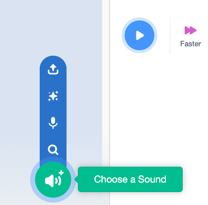
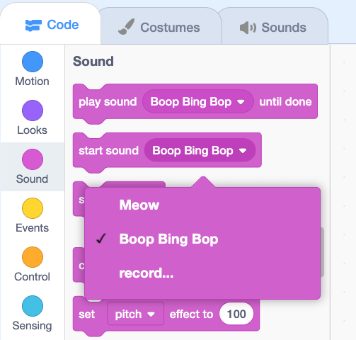

## Soundtrack

Now you're going to add some `sounds`{:class="block3sound"} to your project. Depending on your plans, this could be a continuous background soundtrack or sounds that happen at regular intervals or a combination.

--- task ---
 
Think about what kind of sound you want and when you want that sound to happen.
 
This project has a soundtrack that runs throughout, plus the **Hen** sprite makes a sound every three seconds:
 
**Hen and farmyard**: [See inside](https://scratch.mit.edu/projects/444559955/editor){:target="_blank"}
 
<div class="scratch-preview">
 <iframe src="https://scratch.mit.edu/projects/444559955/embed" allowtransparency="true" width="485" height="402" frameborder="0" scrolling="no" allowfullscreen></iframe>
</div>
 
--- /task ---

There are two `sounds`{:class="block3sound"} blocks with very important differences that you need to understand.

+ When you `play a sound until done`{:class="block3sound"}, the sound will play all the way through until Scratch runs the next line of code in that script. 
+ When you `start a sound`{:class="block3sound"}, the sound will play but the next line of code will run immeadiately and will not wait for the sound to finish first.

This means that if you had a series of `start a sound`{:class="block3sound"} blocks the sounds would all play almost at the same time, layered on top of each other. The effect can be interesting and sometimes messy.

Have a play with it sometime!

```blocks3
when green flag clicked
start sound (meow v)
start sound (alien Creak2 v)
start sound (Boing v)
start sound (Boom Cloud v)
start sound (Baa v)
```

--- collapse ---

---
title: Adding a sound
---

Start by selecting the sprite that you want to have the new sound and select the Sounds tab. Each sprite starts with a default sound.


To get to Scratch's library of built-in sounds, click on the **Choose a sound** button.



If you hover your mouse over the play symbol of a sound, Scratch will preview the sound for you.


Click on any sound to add it to your sprite. You will be taken straight back to the Sounds tab and you will be able to see the sound that you just added.


If you switch to the Code tab and look at the `Sound`{:class="block3sound"} blocks, you will see you the new sound available in the sound playing blocks.
 


--- /collapse ---
 
--- task ---
Add code to run `sounds`{:class="block3sound"} blocks where you want sound in your project.
 
Have a look at the how to’s below that will help you to add the kind of sounds that you want for your project:
 
--- collapse ---

---
title: Continuous soundtrack using a long sound
---
 
**Radio soundtrack**: [See inside](https://scratch.mit.edu/projects/444581851/editor){:target="_blank"}
 
<div class="scratch-preview">
 <iframe allowtransparency="true" width="485" height="402" src="https://scratch.mit.edu/projects/embed/444581851/?autostart=false" frameborder="0"></iframe>
</div>
 
Usually a continuous background soundtrack will start at the beginning when the `green flag`{:class="block3events"} is clicked, but you could have it starting at any time that suits your project.

To make a sound play continuously, use a `play a sound until done`{:class="block3sound"} block inside a `forever`{:class="block3control"} loop. Once the sound has finished, the `forever`{:class="block3control"} loop makes the sound start again from the beginning.

This example uses a single long sound clip repeated as a soundtrack.
 
```blocks3
when green flag clicked
forever
play sound (Dance Snare Beat v) until done
end
```

**Note:** When choosing a new sound, if you select Loops, Scratch will only show you the loops which are mostly the ones suitable for a simgle looping soundtrack.


--- /collapse ---
 
--- collapse ---

---
title: Continuous soundtrack using a sequence of short sounds
---
  
**Champ performance**: [See inside](https://scratch.mit.edu/projects/444673165/editor){:target="_blank"}
 
<div class="scratch-preview">
 <iframe allowtransparency="true" width="485" height="402" src="https://scratch.mit.edu/projects/embed/444673165/?autostart=false" frameborder="0"></iframe>
</div>

Rather than using a single longer looping sound, you may want to loop a series of shorter sounds together. You may want to have a certain sequence of sounds playing in order or perhaps you are just having fun playing with the different sounds, or even composing a piece of music using different instrument notes and effects.

Unless you have a clear idea of what sounds you want to use and their order, the first step would be to get a `forever`{:class="block3control"} loop, pick out some sounds you like and experiment.
 
```blocks3
forever
play sound (Low Boing v) until done
play sound (Low Boing v) until done
play sound (Drum Buzz v) until done
play sound (Pop v) until done
play sound (Bird v) until done
play sound (Bark v) until done
play sound (Glug v) until done
End
```
 
If you click on the `forever`{:class="block3control"} loop, it will keep repeating whatever is inside. As you change the order or the sounds inside, Scratch will play your latest version each time it loops around.

**Note:** The example only uses `play a sound until done`{:class="block3sound"} blocks, so that each sound finishes before the next begin. As you experiment, you might want to try adding some `start sound`{:class="block3sound"} blocks in where you want more than one sound to play at once. For intance you may want to have `start Bark sound`{:class="block3sound"} followed by `play Bird until done`{:class="block3sound"} to get a bird sound and a bark at the same time.

```blocks3
forever
play sound (Low Boing v) until done
start sound (Pop v)
start sound (Finger Snap v)
play sound (Drum Buzz v) until done
+ start sound (Bark v)
+ play sound (Bird v) until done
End
```
Once you have found a sequence that you are happy with and works for your project, add a `when green flag`{:class="block3events"} clicked `Event`{:class="block3events"} block to the top and your sequenced soundtrack will start when your project is run.

```blocks3
when green flag clicked
```
 
--- /collapse ---
 
Or you may just want to use sounds that happen at regular intervals.

--- collapse ---

---
title: Incidental sounds
---
 
**Football sounds**: [See inside](https://scratch.mit.edu/projects/448305841/editor){:target="_blank"}
 
<div class="scratch-preview">
 <iframe allowtransparency="true" width="485" height="402" src="https://scratch.mit.edu/projects/embed/448305841/?autostart=false" frameborder="0"></iframe>
</div>
 
 You can add code to a Sprite or the Stage to play a sound at regular intervals:

 ```blocks3
 when flag clicked
 forever
 wait (5)
 play sound (Cheer v) until done
 ```

 <mark>Would it be better to remove this to avoid clicking on sprites and accidentally dragging them?</mark>

 You can start or play a sound when a Sprite is clicked: 

 ```blocks3
 when this sprite clicked
 play sound (referee whistle v) until done
 ```

--- /collapse ---

--- /task ---
 
--- task ---

Once you have your sounds, you may want to change some details such as setting the `volume`{:class="block3sound"}, the `pitch`{:class="block3sound"}, or changing the `pan`{:class="block3sound"} to make sound come from the left or right.

--- collapse ---

---
title: Setting and changing the volume, pitch and pan effect
---

Click the green flag to hear the sounds. 

**Sound effects**: [See inside](https://scratch.mit.edu/projects/448392543/editor){:target="_blank"}
 
<div class="scratch-preview">
 <iframe allowtransparency="true" width="485" height="402" src="https://scratch.mit.edu/projects/embed/448392543/?autostart=false" frameborder="0"></iframe>
</div>

The pan left/right setting allows you to control whether a sound comes out of the left or right speaker or headphone or both. A value of -100 plays all of the sound through the left speaker, 100 plays all of the sound through the right speaker, values in between play some some through each. 

If you have stereo headphones or speakers then the sound from the left speaker sprite will come from the left headphone/speaker and the sound from the right speaker sprite will come from the right headphone speaker. 

This code sets the pan for the left speaker:

```blocks3
set [pan left/right v] effect to (-100)
```

This code sets the pan for the right speaker:

```blocks3
set [pan left/right v] effect to (100)
```

**Tip**: Listen carefully to where the sound is coming from. 

The pitch of a sound is how high or low it is. Setting the pitch to a higher value also makes a sound faster. You can set the pitch to values between -360 (very low) and 360 (very high). 

This code sets the pitch of the guitar to 200 (high).

```blocks3
set [pitch v] effect to (200)
```

You can set the volume from 0 (silent) to 100 (full volume).

The volume of the guitar is lower than the volume of the speakers. This is useful if you want some sounds louder than others or if you want a sprite to appear further away. 

This code sets the volume of the guitar to 10 (quiet):

```blocks3
set volume to (10) %
```

Sound effects are cleared when the green flag is clicked.

--- /collapse ---
  
--- /task ---
 
 
--- save ---
