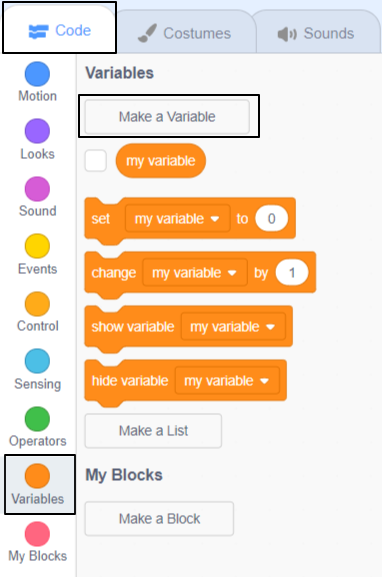
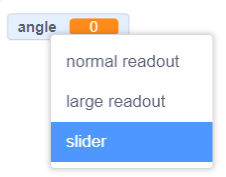

## Control your scene with variables

In this step you will add a variable with a slider to control something in your scene. You could use a variable to control graphic effects, sound effects or timing. 

--- task ---
Think about what you want to be able to control with a variable. 

In this example, the speed variable controls how fast the snowman moves and how fast the snowflake moves and turns:

**Winter scene**: [See inside](https://scratch.mit.edu/projects/447121911/editor){:target="_blank"}

<div class="scratch-preview">
  <iframe allowtransparency="true" width="485" height="402" src="https://scratch.mit.edu/projects/embed/447121911/?autostart=false" frameborder="0"></iframe>
</div>

--- /task ---

--- task ---
Think of a sensible name for your variable.

Make a new variable, for all sprites, and give it the name you have chosen.

--- collapse ---

---

title: Add a new variable

---

Click on the 'Code' tab for any sprite or the Stage. 

Click on `Variables`{:class="block3variables"} and then 'Make a Variable'.
Click on `Variables`{:class="block3variables"} and then 'Make a Variable'.



Name the variable, for example 'speed'. Keep the 'For all sprites' box checked, this means you will be able to use the variable in the code for any of your sprites or the Stage.


Click 'OK' to make the new variable. You will have new Variable blocks available including a `speed`{:class="block3variables"} block that you can use as an input to other blocks. 

--- /collapse ---

--- /task ---

--- task ---
Your new variable will automatically appear on the Stage. 

Change it to a slider with the range 1 to 10, you can change the range later. 

--- collapse ---

---

title: Use a slider to change a variable

---

Right-click or tap and hold on the `speed`{:class="block3variables"} variable on the Stage. 

Select 'slider' from the menu. 



**Tip:** You can double click or tap on a variable on the Stage to switch between normal, large and slider. 

Right-click or tap and hold on the `speed`{:class="block3variables"} variable on the Stage again and choose 'change slider range'. 


Set the range to a minimum of 1 and a maximum of 10:


These are good values to start with but you can change them later.

**Tip:** Variables on the Stage always appear in a layer above all of the sprites. If you have a moving sprite it will go under any variables on the Stage. 

--- /collapse ---

--- /task ---


--- task ---

Use a variable as an input to a block.

Here are some examples you could use to get started. 

--- collapse ---

---

title: Control ghost effect with a variable to see through a sprite

---

**Transparent rainbow**: [See inside](https://scratch.mit.edu/projects/444579529/editor){:target="_blank"}

<div class="scratch-preview">
  <iframe allowtransparency="true" width="485" height="402" src="https://scratch.mit.edu/projects/embed/444579529/?autostart=false" frameborder="0"></iframe>
</div>

You can use a `ghost`{:class="block3data"} variable to control the ghost effect on a sprite at the front and use it to reveal or hide sprites in lower layers. 

```blocks3
when flag clicked
go to [front v] layer
```

```blocks3
when flag clicked
forever
set [ghost v] effect to (ghost)
```

--- /collapse ---

--- collapse ---

---
title: Change the delay in a wait block
---

--- /collapse ---

--- collapse ---

---

title: Control movement speed with a variable

---

**Ladybug from above**: [See inside](https://scratch.mit.edu/projects/447139076/editor){:target="_blank"}

<div class="scratch-preview">
  <iframe allowtransparency="true" width="485" height="402" src="https://scratch.mit.edu/projects/embed/447139076/?autostart=false" frameborder="0"></iframe>
</div>

Use the `speed`{:class="block3variables"} variable as the input to a `move () steps`{:class="block3motion"} block:

```blocks3
when flag clicked
forever
move (speed) steps
if on edge, bounce
```

Set the minimum and maximum values for the range of the slider to suit your project. 

--- /collapse ---

--- collapse ---

---

title: Control turn speed with a variable

---

**Space dog**: [See inside](https://scratch.mit.edu/projects/447146281/editor){:target="_blank"}

<div class="scratch-preview">
  <iframe allowtransparency="true" width="485" height="402" src="https://scratch.mit.edu/projects/embed/447146281/?autostart=false" frameborder="0"></iframe>
</div>

Use the `speed`{:class="block3variables"} variable as the input to a `turn right () degrees`{:class="block3variables"} block:

```blocks3
when flag clicked
forever
turn right (speed) degrees
```

Set the minimum and maximum values for the range of the slider to suit your project. If you include negative values in your range then you can make your sprite turn in the opposite direction. `turn right (-10) degrees` will actually turn left (anti-clockwise) by 10 degrees. 

--- /collapse ---

--- /task ---

--- task ---
Experiment with using your variable to control the scene. 

Things to try:
+ Change the range of the slider so that you are happy with the maximum and minimum values. Choose values that make sense for your project. 
+ Include `0` or negative numbers in the range for your slider. What happens?

**Tip:** If you are using a computer with a keyboard then you can use the arrow keys to change the value of a slider by 1. First click on the slider to select it and then use the left arrow to change the value by -1 and the right arrow key to change the value by 1.

--- /task ---

--- save ---
