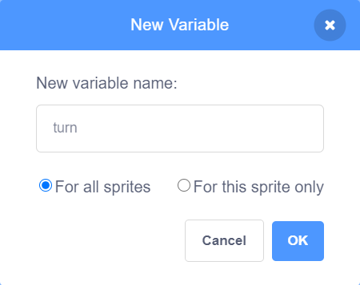
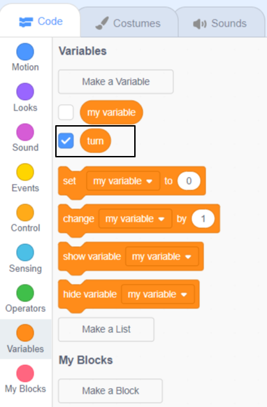
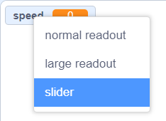
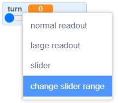
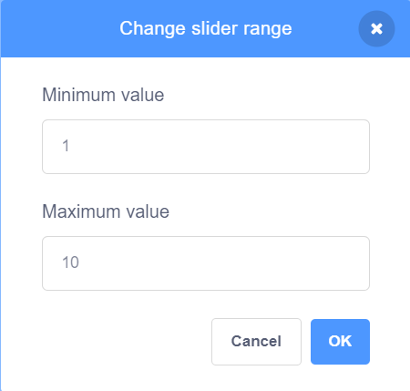
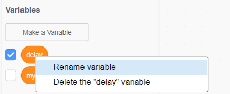

## Control your scene with variables

In this step you will add one or more variables with sliders to control something in your scene such as graphic effects, sound effects, movement or timing. 

--- task --- 

Look at the example below. The `speed`{:class="block3variables"} variable controls how fast the snowman moves, `size`{:class="block3variables"} controls the size of the snowflake, and `pitch`{:class="block3variables"} controls the pitch of the music that is playing:

**Winter scene**: [See inside](https://scratch.mit.edu/projects/447121911/editor){:target="_blank"}

<div class="scratch-preview">
  <iframe allowtransparency="true" width="485" height="402" src="https://scratch.mit.edu/projects/embed/447121911/?autostart=false" frameborder="0"></iframe>
</div>

--- /task ---

--- task ---

Decide what you want to control using a variable. 

Create a new variable and give it the name that matches its use. For example, if it will control how quickly a sprite spins, name it `turn`{:class="block3variables"}.

<mark>Should we give more examples such as volume, colour, size, ghost, brightness?</mark>

--- collapse ---

---

title: Add a new variable

---

Click on the 'Code' tab for any sprite or the Stage. 

Go to the `Variables`{:class="block3variables"} blocks and click on 'Make a Variable'.


Name the variable to match its use, for example `turn`{:class="block3variables"}. Generally, you will keep the 'For all sprites' box checked, this means you will be able to use the variable in the code for any of your sprites or the Stage.



Click 'OK' to make the new variable. You will have new variable blocks available including a `turn`{:class="block3variables"} block (or whatever you named your variable) that you can drag and use as an input to other blocks. 




--- /collapse ---

--- /task ---

Your new variable will automatically appear on the Stage.

--- task ---
 
Change it to a slider. It will start with a range from 1 to 100 which you can change at any point. 

--- collapse ---

---

title: Use a slider to change a variable

---

Right-click or tap and hold on your variable on the Stage. 

Select 'slider' from the menu. 



**Tip:** You can double click or tap on a variable on the Stage to switch between normal, large and slider. 

Right-click or tap and hold on your variable on the Stage again and choose 'change slider range'. 


Set the range by specifying a minimum and maximum value.

A minimum of 1 and a maximum of 10 work fairly well for how quickly a sprite spins.



The value range that is right for your variable depends on what you are using it for. Sometimes you will need to experiment a little to get it right but remember that you can change it at any time.

You can drag the slider to a convenient position on the Stage.

**Tip:** Variables on the Stage always appear in a layer above all of the sprites. If you have a moving sprite it will go under any variables on the Stage. 

--- /collapse ---

--- /task ---

--- task ---

Use your variable input block to control something in your project, such as changing the size of a sprite, the way it looks or the volume of a sound.

In this example the variable controls how quickly the sprite rotates:

**Space dog**: [See inside](https://scratch.mit.edu/projects/447146281/editor){:target="_blank"}

<div class="scratch-preview">
  <iframe allowtransparency="true" width="485" height="402" src="https://scratch.mit.edu/projects/embed/447146281/?autostart=false" frameborder="0"></iframe>
</div>

Use the `turn`{:class="block3variables"} variable as the input to a `turn right`{:class="block3motion"} block:

```blocks3
when flag clicked
forever
turn right (turn) degrees
```

Here are some more examples of how you can use your variable slider: 

--- collapse ---

---

title: Control graphic effects with a variable

---

This example changes the ghost graphics effect so you can see through the rainbow.

**Transparent rainbow**: [See inside](https://scratch.mit.edu/projects/444579529/editor){:target="_blank"}

<div class="scratch-preview">
  <iframe allowtransparency="true" width="485" height="402" src="https://scratch.mit.edu/projects/embed/444579529/?autostart=false" frameborder="0"></iframe>
</div>

You can use a `ghost`{:class="block3data"} variable to control the ghost effect on a sprite at the front and use it to reveal or hide sprites in lower layers. 

```blocks3
when flag clicked
go to [front v] layer
```

```blocks3
when flag clicked
forever
set [ghost v] effect to (ghost)
```

Try using the same approach with other graphic effects such as brightness or colour.

--- /collapse ---

--- collapse ---

---

title: Control move or turn speed with a variable

---

**Ladybug from above**: [See inside](https://scratch.mit.edu/projects/447139076/editor){:target="_blank"}

<div class="scratch-preview">
  <iframe allowtransparency="true" width="485" height="402" src="https://scratch.mit.edu/projects/embed/447139076/?autostart=false" frameborder="0"></iframe>
</div>

Use the `speed`{:class="block3variables"} variable as the input to a `move () steps`{:class="block3motion"} block:

```blocks3
when flag clicked
forever
move (speed) steps
if on edge, bounce
```
Set the minimum and maximum values for the range of the slider to suit your project.

--- /collapse ---

--- collapse ---

---

title: Change the delay in a wait block

---

**Dance delay**: [See inside](https://scratch.mit.edu/projects/447752917/editor){:target="_blank"}

<div class="scratch-preview">
  <iframe allowtransparency="true" width="485" height="402" src="https://scratch.mit.edu/projects/embed/447752917/?autostart=false" frameborder="0"></iframe>
</div>

Use a `delay`{:class="block3variables"} variable as the input to a `wait`{:class="block3motion"} block:

```blocks3
when flag clicked
forever
wait (delay) seconds
next costume
```

A delay of more than one second is quite a long time. If you include a decimal number in the range of a slider then you can change the value 100th of a second at a time. 

A range of 0 to 1.0 would let you choose value between 0 seconds (no delay) and 1 second.

This example lets you choose values between one hundredth of a second (0.01) and 3 tenths of a second (0.30). 


Try changing the numbers to get the maximum and minumum that you want users to be able to use in your project.

--- /collapse ---

--- collapse ---

---

title: Change sound effects

---

**Sound speed**: [See inside](https://scratch.mit.edu/projects/444614449/editor){:target="_blank"}

<div class="scratch-preview">
  <iframe allowtransparency="true" width="485" height="402" src="https://scratch.mit.edu/projects/embed/444614449/?autostart=false" frameborder="0"></iframe>
</div>

Changing the pitch of a sound also speeds it up. 

```blocks3
when flag clicked
forever
set [pitch v] effect to (speed)
```

Play the sound in a separate forever loop so that the pitch will change immediately rather than waiting until the sound is done: 

```blocks3
when flag clicked
forever
play sound [Dance Head Nod v] until done
```

You can also use a variable to change the volume and pan/tilt effect.

--- /collapse ---

--- /task ---

 You may have already realised that you can control different sprites, or different effects, using the same variable.

--- collapse ---

---

title: Controlling more than one sprite using the same variable

---

**Under the waves**: [See inside](https://scratch.mit.edu/projects/447874869/editor){:target="_blank"}

<div class="scratch-preview">
  <iframe allowtransparency="true" width="485" height="402" src="https://scratch.mit.edu/projects/embed/447874869/?autostart=false" frameborder="0"></iframe>
</div>

There is nothing really new to learn here. You will simply use the same variable in more than one place. It may be to control the speed of two different sprites, or the moving speed of a sprite and the pitch of a sound at the same time.

You can use the same variable as many times as you like in a project, and as long as you left 'for all sprites' selected, it can be used for any sprites at the same time.

Here are some examples of a variable, simply called `variable`{:class="block3variables"}, being used in different scripts at the same time:

```blocks3
when flag clicked
set rotation style [left-right v]
forever
move (variable) steps
if on edge, bounce
end

when flag clicked
forever
set [pitch v] effect to (variable)
end

when flag clicked
forever
set [whirl v] effect to (variable)
end

when flag clicked
forever
wait (variable) seconds
next costume
end

when flag clicked
forever
turn right (variable) degrees
end
```

All of these scripts can use the same variable at the same time. 

--- /collapse ---

--- collapse ---

---

title: Renaming a variable

---

Sometimes you think of a better name for a variable. 

You can give a variable a new name by going to the Variables section, right-clicking on the variable and choosing 'rename'.



This will change the name of the variable in all the code blocks where you have used it. 

--- /collapse ---

--- task ---
Add as many `variables`{:class="block3variables"} as you like to control movement, delays, visual effects and sound effects.

Things to consider:
+ Have your given your variables names that match what they are used for?
+ Have you chosen the best maximum and minumum values for your sliders?
+ Are your sliders neatly arranged on the Stage?

--- /task ---

**Tip:** If you are using a computer with a keyboard then you can use the arrow keys to change the value of a slider by 1. First click on the slider to select it and then use the left arrow to change the value by -1 and the right arrow key to change the value by 1.

--- save ---
