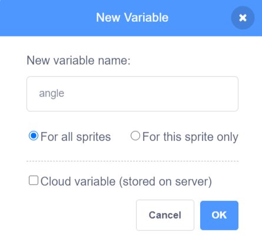
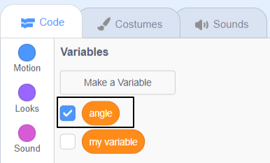
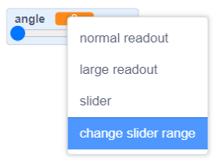

## User control

In this step you will add one or more variables with sliders to control something in your scene such as graphic effects, sound effects, movement or timing. 

--- task --- 

Look at the example below. The `speed`{:class="block3variables"} variable controls how fast the snowman moves, `snowflake`{:class="block3variables"} controls the snowflake size, and `music`{:class="block3variables"} controls the pitch of the music that is playing:

**Winter scene**: [See inside](https://scratch.mit.edu/projects/451563340/editor){:target="_blank"}

<div class="scratch-preview">
  <iframe allowtransparency="true" width="485" height="402" src="https://scratch.mit.edu/projects/embed/451563340/?autostart=false" frameborder="0"></iframe>
</div>

--- /task ---

--- task ---

Decide what you want to control using a variable. 

Create a new variable and give it a name that matches its use. For example: 

+ if it will control the `volume`{:class="block3sound"} of a sound, name it `noise`{:class="block3variables"}
+ if it will control the length of a `wait`{:class="block3control"}, name it `delay`{:class="block3variables"}
+ if it will control how many degrees a sprite turns, name it `angle`{:class="block3variables"}

--- collapse ---

---

title: Add a new variable

---

Click on the **Code** tab for any sprite or the Stage. 

Go to the `Variables`{:class="block3variables"} blocks menu and click on 'Make a Variable'.


Name the variable to match its use, for example `angle`{:class="block3variables"}. 

You will keep the 'For all sprites' box checked, this means you will be able to use the variable in the code for any of your sprites or the Stage.



Click 'OK' to make the new variable. You will have new variable blocks available including an `angle`{:class="block3variables"} block (or whatever you named your variable) that you can drag and use as an input to other blocks. 




--- /collapse ---

--- /task ---

Your new variable will automatically appear on the Stage.

--- task ---
 
Change the variable to a slider and change its range.

--- collapse ---

---

title: Use a slider to set a variable

---

Right-click or tap and hold on your variable on the Stage. 

Select **Slider** from the menu. 


**Tip:** You can double-click or tap on the variable displayed on the Stage and select **slider**.

Right-click or tap and hold on the variable displayed on the Stage and select **change slider range**.



Set the range by specifying a minimum and maximum value.

A minimum of `1` and a maximum of `10` work fairly well for how quickly a sprite spins.


The value range that is right for your variable depends on what you are using it for. Sometimes you will need to experiment a little to get it right but remember that you can change it at any time.

Drag the slider to a convenient position on the Stage.

**Tip:** Variables on the Stage always appear in a layer above all of the sprites. If you have a moving sprite it will go under any variables on the Stage. 

--- /collapse ---

--- /task ---

--- task ---

Use your variable input block to control something in your project, such as changing the size of a sprite, the way it looks or the volume of a sound.

In this example the variable controls how quickly the sprite rotates:

**Space dog**: [See inside](https://scratch.mit.edu/projects/451543041/editor){:target="_blank"}

<div class="scratch-preview">
  <iframe allowtransparency="true" width="485" height="402" src="https://scratch.mit.edu/projects/embed/451543041/?autostart=false" frameborder="0"></iframe>
</div>

The **Space dog** project uses the `angle`{:class="block3variables"} variable as the input to a `turn right`{:class="block3motion"} block:

```blocks3
when flag clicked
forever
turn right (angle) degrees
```

Here are some more examples of how you can use your variable slider: 

--- collapse ---

---

title: Control graphic effects with a variable

---

This example changes the ghost graphics effect so you can see through the rainbow.

**Transparent rainbow**: [See inside](https://scratch.mit.edu/projects/451544795/editor){:target="_blank"}

<div class="scratch-preview">
  <iframe allowtransparency="true" width="485" height="402" src="https://scratch.mit.edu/projects/embed/451544795/?autostart=false" frameborder="0"></iframe>
</div>

You can use a `transparent`{:class="block3data"} variable to control the ghost effect on a sprite at the front and use it to reveal or hide sprites in lower layers. 

```blocks3
when flag clicked
go to [front v] layer
```

```blocks3
when flag clicked
forever
set [ghost v] effect to (transparent)
```

Try using the same approach with other graphic effects such as `brightness`{:class="block3data"} or `color`{:class="block3data"}.

--- /collapse ---

--- collapse ---

---

title: Control move speed with a variable

---

**Ladybug on a wall**: [See inside](https://scratch.mit.edu/projects/451545341/editor){:target="_blank"}

<div class="scratch-preview">
  <iframe allowtransparency="true" width="485" height="402" src="https://scratch.mit.edu/projects/embed/451545341/?autostart=false" frameborder="0"></iframe>
</div>

Use the `speed`{:class="block3variables"} variable as the input to a `move`{:class="block3motion"} block:

```blocks3
when flag clicked
forever
move (speed) steps
if on edge, bounce
```
Set the minimum and maximum values for the range of the slider to suit your project.

--- /collapse ---

--- collapse ---

---

title: Change the delay in a wait block

---

**Skeleton dance**: [See inside](https://scratch.mit.edu/projects/451536565/editor){:target="_blank"}

<div class="scratch-preview">
  <iframe allowtransparency="true" width="485" height="402" src="https://scratch.mit.edu/projects/embed/451536565/?autostart=false" frameborder="0"></iframe>
</div>

Use a `delay`{:class="block3variables"} variable as the input to a `wait`{:class="block3motion"} block:

```blocks3
when flag clicked
forever
wait (delay) seconds
next costume
```

A delay of more than one second is quite a long time. If you include a decimal number in the range of a slider then you can change the value 100th of a second at a time. 

A range of 0.0 to 1.0 allows you to choose a delay between 0 seconds (no delay) and 1 second.


Try changing the numbers to get the maximum and minumum that you want users to be able to use in your project.

--- /collapse ---

--- collapse ---

---

title: Change sound effects

---

**Drum pitch**: [See inside](https://scratch.mit.edu/projects/451547017/editor){:target="_blank"}

<div class="scratch-preview">
  <iframe allowtransparency="true" width="485" height="402" src="https://scratch.mit.edu/projects/embed/451547017/?autostart=false" frameborder="0"></iframe>
</div>

Changing the pitch of a sound makes the notes higher and also speeds it up. 

```blocks3
when flag clicked
forever
set [pitch v] effect to (beat)
```

Play the sound in a separate forever loop so that the pitch will change immediately rather than waiting until the sound is done: 

```blocks3
when flag clicked
forever
play sound [Dance Head Nod v] until done
```

You can also use a variable to change the volume and pan/tilt effect.

--- /collapse ---

--- /task ---

 You may have already realised that you can control different sprites, or different effects, using the same variable.

--- collapse ---

---

title: Controlling more than one sprite using the same variable

---

**Under the waves**: [See inside](https://scratch.mit.edu/projects/447874869/editor){:target="_blank"}

<div class="scratch-preview">
  <iframe allowtransparency="true" width="485" height="402" src="https://scratch.mit.edu/projects/embed/447874869/?autostart=false" frameborder="0"></iframe>
</div>

You can use the same variable in more than one place. It may be to control the speed of two different sprites, or the moving speed of a sprite and the pitch of a sound at the same time.

You can use the same variable as many times as you like in a project, and as long as you left 'for all sprites' selected, it can be used for any sprites at the same time.

Here are some examples of a variable, called `my variable`{:class="block3variables"}, being used in different scripts at the same time:

```blocks3
when flag clicked
set rotation style [left-right v]
forever
move (my variable) steps
if on edge, bounce
end

when flag clicked
forever
set [pitch v] effect to (my variable)
end

when flag clicked
forever
set [whirl v] effect to (my variable)
end

when flag clicked
forever
wait (my variable) seconds
next costume
end

when flag clicked
forever
turn right (my variable) degrees
end
```

All of these scripts can use the same variable at the same time. 

--- /collapse ---

Sometimes it's useful to use operators (+, -, x or ÷) with variables to calculate different numbers.

--- collapse ---

--- 

title: Using operators with variables

---

You may want to use a single `variable`{:class="block3variables"} for multiple tasks but the value needs to be adjusted in some way for one use.

+ `wait`{:class="block3control"} times often need to be very small 
+ `size`{:class="block3looks"} values are often quite larger
+ `pan`{:class="block3sound"} can use negative values

In this case you may need to use an `operator`{:class="block3operators"} to adjust the value:

**Space balance**: [See inside](https://scratch.mit.edu/projects/451682050/editor){:target="_blank"}

<div class="scratch-preview">
  <iframe allowtransparency="true" width="485" height="402" src="https://scratch.mit.edu/projects/embed/451682050/?autostart=false" frameborder="0"></iframe>
</div>

In this example, the size of the first sprite is set to `balance`{:class="block3variables"} while the size of the second sprite is set to 100 minus `balance`{:class="block3variables"}. 

If the size of the first sprite is 30 then the size of the second sprite will be 70 (which is 100 - 30). 

```blocks3
when flag clicked
forever
set size to ((100) - (balance))%
```

You can use `*` to multiply and make a number bigger. It's useful to be able to set the pitch to a bigger number than a `speed`{:class="block3variables"} variable:

```blocks3
when flag clicked
forever
set [pitch v] effect to ((speed) * (20))
```

--- /collapse ---

You can rename a variable if you change your mind:

--- collapse ---

---

title: Renaming a variable

---

Sometimes you think of a better name for a variable. 

You can give a variable a new name by going to the Variables section, right-clicking on the variable and choosing 'Rename variable'.


This will change the name of the variable in all the code blocks where you have used it. 

--- /collapse ---

--- task ---
Add as many `variables`{:class="block3variables"} as you like to control movement, delays, visual effects and sound effects. 

Things to consider:
+ Have you given your variables names that match what they are used for?
+ Have you chosen the best maximum and minumum values for your sliders?
+ Are your sliders neatly arranged on the Stage?
+ Is it helpful to use the same variable in multiple places?

--- /task ---

**Tip:** If you are using a computer with a keyboard then you can use the arrow keys to change the value of a slider by 1. First click on the slider to select it and then use the left arrow to change the value by -1 and the right arrow key to change the value by 1.

--- save ---
