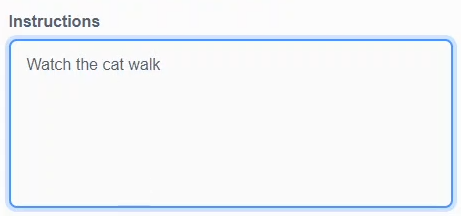
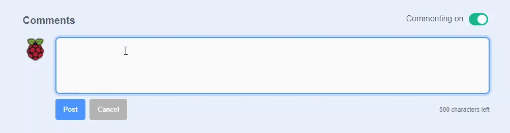
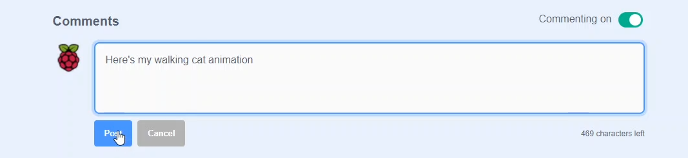
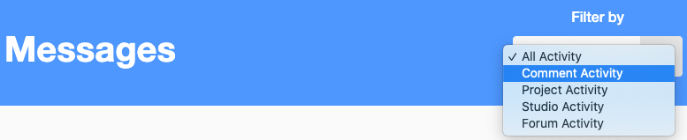

## Share

--- task ---

If you are in a club, share your project with friends and peers, or if you are at home, show your family your project, to gain useful feedback.

--- /task ---

--- task ---

If you have a Scratch account, you can share your project by sending a link to people you know. The whole Scratch community will be able to find your project and try it too! 

--- collapse ---
---

title: Share Scratch projects

---

- Please make sure that you **do not** share any personal information about yourself when sharing your Scratch projects.

- Give your Scratch project a name.

--- no-print ---

--- /no-print ---

--- print-only ---

--- /print-only ---

- Click the **Share** button to make the project public.

--- no-print ---

--- /no-print ---

--- print-only ---

--- /print-only ---

- If you like, you can add instructions to tell other people how to use your project.

--- no-print ---

--- /no-print ---

--- print-only ---

--- /print-only ---

- If this is an original project, you can add some short comments. If you have remixed it, you can credit the original creator.

--- no-print ---

--- /no-print ---

--- print-only ---

--- /print-only ---

- Click the **Copy Link** button to get the link to your project. You can send this link to other people by email or text, or on social media. Why not invite your friends to create a project? Let them know how you had fun.

--- no-print ---

--- /no-print ---

--- print-only ---

--- /print-only ---

--- /collapse ---

--- /task ---

--- task ---

If you have a Scratch account, and have shared your 3D scene project, you can comment on your own and other people's projects. Other people's feedback is a great way to reflect on your work.

If you are under 13 years old, or do not want to allow people to comment on your project, you should turn off commenting.

--- collapse ---
---

title: Feedback using Scratch comments

---

- If you are happy and feel safe to allow people to write comments on your project, you can leave the first comment.

--- no-print ---

--- /no-print ---

--- print-only ---

--- /print-only ---

--- /collapse ---

Keep an eye out for comments that others may make about your creation. Ignore any comments that are unhelpful or irrelevant.

--- collapse ---
---

title: Check your Scratch comment activity

---

If you are logged in to your Scratch account, you will see a **Message** icon in the **Navigation bar**.

If you have new messages, the number of new messages will appear surrounded by an **orange circle**.

Click on the **Message** icon to access your inbox. If you have a lot of new messages, you can use the drop-down menu on the right to filter for **Comment Activity** only.

--- /collapse ---

--- /task ---

--- task ---

Inspire the Raspberry Pi Foundation community with your project!

We regularly share projects made by the community in our challenges. To submit your 3D scene project, please complete [this form](https://www.tfaforms.com/4866927){:target=”_blank”}.

Remember to revisit the challenges to get inspired by other creators and, who knows, one of the projects shared might be yours!

--- /task ---
